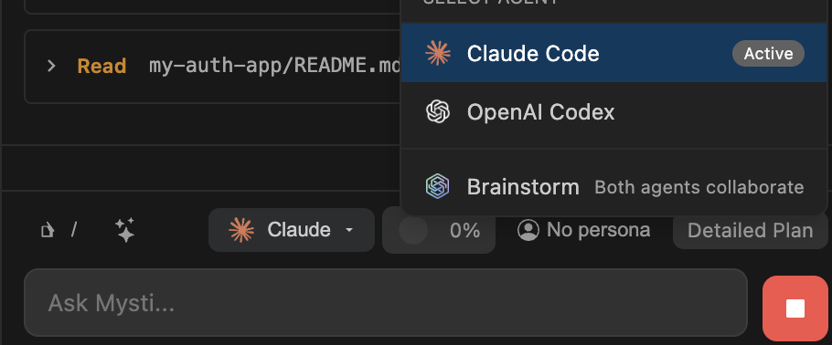
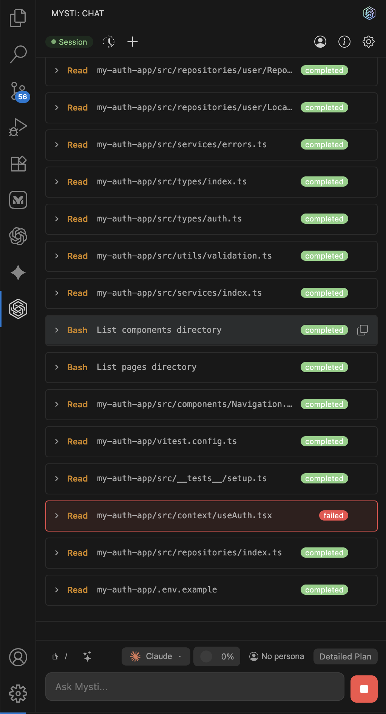
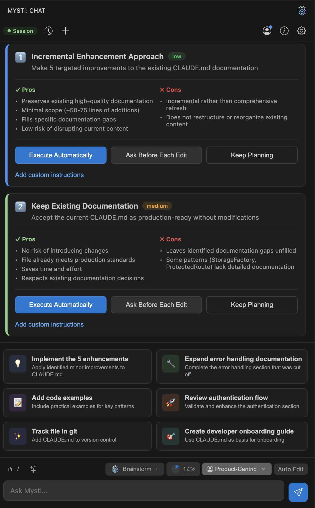
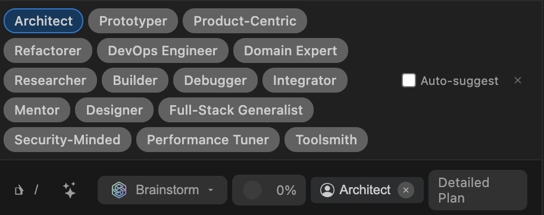
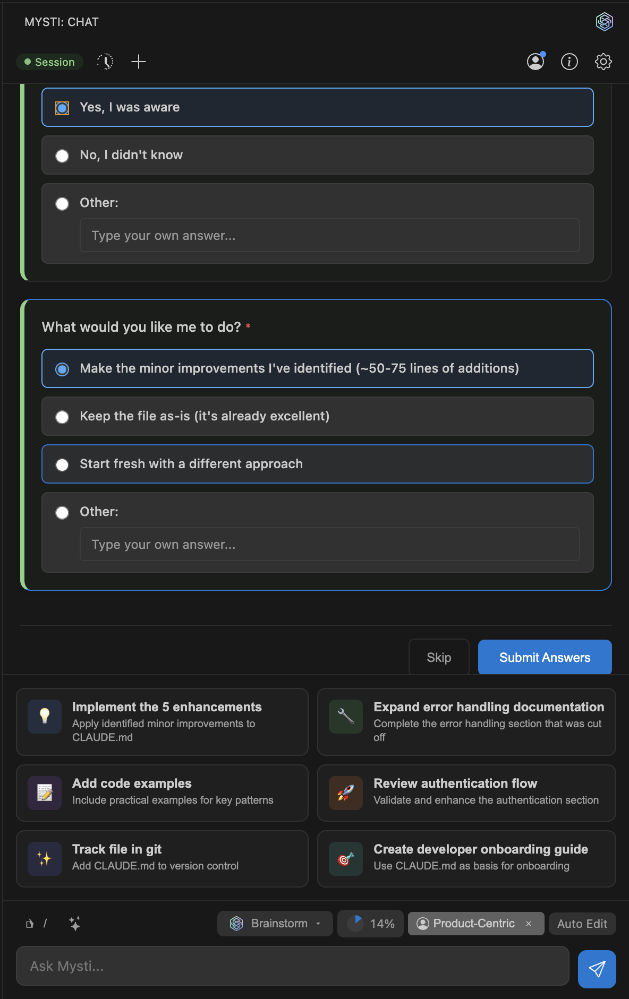
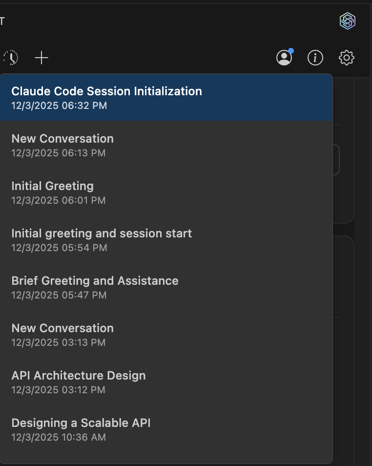
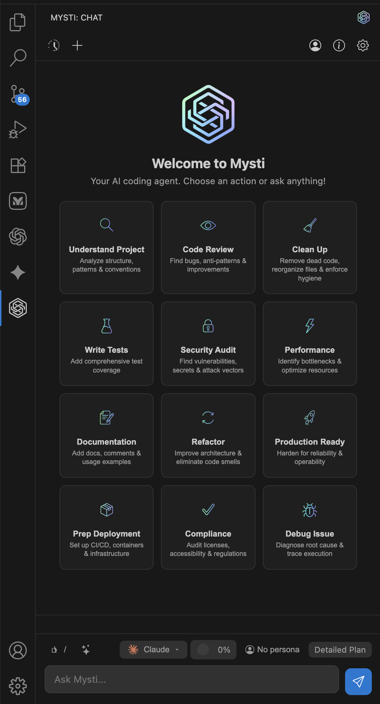
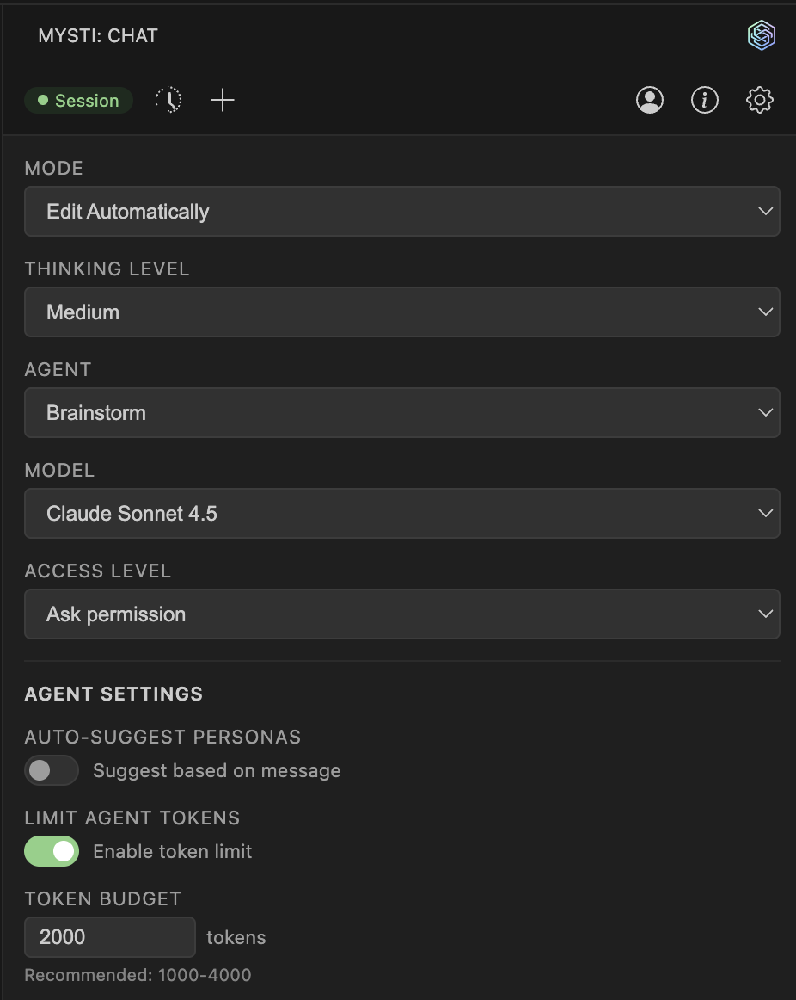

# Mysti - Your AI Coding Team Working Together

<p align="center">
  
</p>

<p align="center">
  <a href="https://marketplace.visualstudio.com/items?itemName=DeepMyst.mysti">
    
  </a>
  <a href="https://marketplace.visualstudio.com/items?itemName=DeepMyst.mysti">
    
  </a>
  <a href="https://marketplace.visualstudio.com/items?itemName=DeepMyst.mysti">
    
  </a>
  <a href="https://github.com/DeepMyst/Mysti/stargazers">
    
  </a>
  <a href="https://github.com/DeepMyst/Mysti/network/members">
    
  </a>
  <a href="https://github.com/DeepMyst/Mysti/blob/main/LICENSE">
    
  </a>
</p>

<p align="center">
  <strong>Your AI Coding team for VSCode</strong><br>
  <em>7 AI providers — Claude Code, Codex, Gemini, Copilot, Cline, Cursor & OpenClaw — working solo or in teams</em><br>
  <em>Wisdom of the crowd where the collective intelligence of several agents outperforms a single one.</em>
</p>

<p align="center">
  <a href="https://marketplace.visualstudio.com/items?itemName=DeepMyst.mysti">
    
  </a>
</p>

<p align="center">
  <a href="#choose-your-ai">Providers</a> •
  <a href="#brainstorm-mode">Brainstorm</a> •
  <a href="#key-features">Features</a> •
  <a href="#quick-start">Quick Start</a> •
  <a href="#configuration">Config</a> •
  <a href="#documentation">Docs</a>
</p>

---

## What's New in v0.3.0

### 7 AI Providers

Mysti now supports **7 AI providers** — added **Cursor**, **OpenClaw**, and **Cline** alongside Claude Code, Codex, Gemini, and GitHub Copilot. Switch between providers with one click or use `@agent` mentions to route tasks to specific AIs.

### Autonomous Mode

Let the AI work independently with built-in safety controls. A three-level safety classifier (safe/caution/blocked) evaluates every operation, while a learning memory system adapts to your preferences over time. [Learn more](docs/AUTONOMOUS-MODE.md)

### @-Mention System

Type `@claude`, `@gemini`, or any agent name to route tasks directly. Chain agents for multi-perspective workflows: `@claude Write a sort function, then @codex optimize it`. Reference files with `@filename.ts` for instant context. [Learn more](docs/MENTIONS.md)

### 5 Brainstorm Collaboration Strategies

Brainstorm Mode now offers 5 strategies — **Quick**, **Debate**, **Red-Team**, **Perspectives**, and **Delphi** — each with role-based discussion and convergence detection. [Learn more](docs/BRAINSTORM.md)

### Context Compaction

Smart conversation compaction prevents context overflow. Native `/compact` support for Claude Code, with client-side summarization for other providers. [Learn more](docs/COMPACTION.md)

---

## Install in Seconds

**From VS Code:** Press `Ctrl+P` (`Cmd+P` on Mac), then paste:

```
ext install DeepMyst.mysti
```

**Or** [install from the VS Code Marketplace](https://marketplace.visualstudio.com/items?itemName=DeepMyst.mysti)

---

## Choose Your AI

Mysti works with the AI coding tools you already have. **No extra subscriptions needed.**

<p align="center">
  
</p>

| Provider | Best For |
|----------|----------|
| **Claude Code** | Deep reasoning, complex refactoring, thorough analysis |
| **Codex** | Quick iterations, familiar OpenAI style |
| **Gemini** | Fast responses, Google ecosystem integration |
| **GitHub Copilot** | Multi-model access (Claude, GPT-5, Gemini) via GitHub subscription |
| **Cline** | Plan/Act mode, structured task completion |
| **Cursor** | Auto model selection, multi-model with Claude, GPT-5, Gemini |
| **OpenClaw** | Real-time WebSocket streaming, configurable thinking levels |

**Switch providers with one click. No lock-in.**

### Why Mysti?

| vs Copilot/Cursor | Mysti Advantage |
|-------------------|-----------------|
| Single AI | **Multi-agent brainstorming** — two AIs collaborate with 5 strategies |
| Locked to one provider | **7 providers** — Claude, Codex, Gemini, Copilot, Cline, Cursor, OpenClaw |
| Black box | **Full permission control** — read-only to full-access |
| Generic responses | **16 personas** — architect, debugger, security expert... |
| Manual workflow | **Autonomous mode** — AI works independently with safety controls |
| No cross-agent routing | **@-mentions** — route tasks to specific agents inline |

---

## See It In Action

<p align="center">
  
</p>

<p align="center"><em>Beautiful, modern chat interface with syntax highlighting, markdown support, and mermaid diagrams</em></p>

---

## Brainstorm Mode

**Want a second opinion?** Enable Brainstorm Mode and let two AI agents tackle your problem together. **Choose any 2 of 7 agents** from the settings panel.

<p align="center">
  
</p>

### 5 Collaboration Strategies

| Strategy | Roles | Best For |
|----------|-------|----------|
| **Quick** | Direct synthesis | Simple tasks, fast answers |
| **Debate** | Critic vs Defender | Architecture decisions, trade-offs |
| **Red-Team** | Proposer vs Challenger | Security reviews, edge case discovery |
| **Perspectives** | Risk Analyst vs Innovator | Greenfield design, technology selection |
| **Delphi** | Facilitator vs Refiner | Complex problems, reaching consensus |

### Why Two AIs Beat One

**Claude Code** (Anthropic), **Codex** (OpenAI), **Gemini** (Google), **GitHub Copilot**, **Cline**, **Cursor**, and **OpenClaw** have different training, different strengths, and different blind spots. When any two work together:

- Each AI catches edge cases the other might miss
- Different perspectives lead to more robust solutions
- **Together** they debate, challenge each other, and synthesize the best solution

It's like having a senior dev and a tech lead review your code—except they actually discuss it first.

### Convergence Detection

During discussions, Mysti tracks agent agreement and position stability. When **auto-convergence** is enabled, the discussion exits early once agents reach consensus — saving time without sacrificing quality.

### Choose Your Team

Configure which two agents collaborate in the **Settings Panel**:

| Combination | Best For |
|-------------|----------|
| Claude + Codex | Deep analysis meets rapid iteration |
| Claude + Gemini | Thorough reasoning with fast validation |
| Claude + Copilot | Compare native Claude vs Copilot's multi-model approach |
| Cursor + Gemini | Multi-model flexibility with Google integration |
| OpenClaw + Claude | WebSocket streaming with deep reasoning |

[Full Brainstorm documentation](docs/BRAINSTORM.md)

### Intelligent Plan Detection

When the AI presents multiple implementation approaches, Mysti automatically detects them and lets you choose your preferred path.

<p align="center">
  
</p>

*Requires at least 2 CLI tools installed. See [Requirements](#requirements).*

---

## Key Features

### Autonomous Mode

Let the AI work independently with configurable safety controls:

- **Safety Classifier**: Three levels — safe (auto-approve), caution (mode-dependent), blocked (always deny)
- **Three Safety Modes**: Conservative, Balanced, Aggressive
- **Learning Memory**: Remembers your permission preferences and improves over time
- **Continuation Modes**: Goal-based or task-queue for extended autonomous sessions
- **Audit Trail**: Every autonomous decision is logged for review

[Full Autonomous Mode documentation](docs/AUTONOMOUS-MODE.md)

### @-Mention System

Route tasks to specific agents and reference files inline:

```
@claude Review this code for security issues
@src/auth.ts @gemini Suggest performance improvements for this file
@claude Write tests, then @codex optimize them
```

- **File mentions**: `@filename` adds transient context
- **Agent mentions**: `@agent` routes tasks to that provider
- **Chaining**: Later agents receive earlier agents' responses as context

[Full @-Mention documentation](docs/MENTIONS.md)

### Context Compaction

Smart conversation management that prevents context overflow:

- **Automatic**: Triggers when token usage approaches the threshold (default 75%)
- **Native support**: Claude Code uses built-in `/compact` command
- **Client-side**: Other providers use intelligent message summarization
- **Per-panel tracking**: Each chat panel tracks usage independently

[Full Compaction documentation](docs/COMPACTION.md)

### 16 Developer Personas

Shape how your AI thinks. Select from specialized personas that change the AI's approach to your problems.

<p align="center">
  
</p>

| Persona | Focus |
|---------|-------|
| **Architect** | System design, scalability, clean structure |
| **Debugger** | Root cause analysis, bug fixing |
| **Security-Minded** | Vulnerabilities, threat modeling |
| **Performance Tuner** | Optimization, profiling, latency |
| **Prototyper** | Quick iteration, PoCs |
| **Refactorer** | Code quality, maintainability |
| + 10 more... | Full-Stack, DevOps, Mentor, Designer... |

[Full Personas & Skills documentation](docs/PERSONAS-AND-SKILLS.md)

---

### Quick Persona Selection

Select personas directly from the toolbar without opening panels.

<p align="center">
  
</p>

---

### Smart Auto-Suggestions

Mysti automatically suggests relevant personas and actions based on your message.

<p align="center">
  
</p>

---

### Conversation History

Never lose your work. All conversations are saved and easily accessible.

<p align="center">
  
</p>

---

### Quick Actions on Welcome

Get started fast with one-click actions for common tasks.

<p align="center">
  
</p>

---

### Extensive Settings

Fine-tune every aspect of Mysti including token budgets, access levels, and brainstorm mode.

<p align="center">
  
</p>

---

## Requirements

**Already paying for Claude, ChatGPT, Gemini, or GitHub Copilot? You're ready to go.**

Mysti works with your existing subscriptions—no additional costs!

| CLI Tool | Subscription | Install |
|----------|--------------|---------|
| **Claude Code** (recommended) | Anthropic API or Claude Pro/Max | `npm install -g @anthropic-ai/claude-code` |
| **GitHub Copilot CLI** | GitHub Copilot Pro/Pro+/Business | `npm install -g @github/copilot-cli` |
| **Gemini CLI** | Google AI API or Gemini Advanced | `npm install -g @google/gemini-cli` |
| **Codex CLI** | OpenAI API | Follow OpenAI's installation guide |
| **Cline** | Depends on model provider | `npm install -g cline` |
| **Cursor** | Cursor subscription | `curl https://cursor.com/install -fsS \| bash` |
| **OpenClaw** | OpenClaw account | `npm install -g openclaw@latest && openclaw onboard --install-daemon` |

You only need **one** CLI to get started. Install **any two** to unlock Brainstorm Mode.

---

## Quick Start

### 1. Install Mysti

**Option A:** Press `Ctrl+P` (`Cmd+P` on Mac), paste and run:
```
ext install DeepMyst.mysti
```

**Option B:** [Install from VS Code Marketplace](https://marketplace.visualstudio.com/items?itemName=DeepMyst.mysti)

### 2. Install a CLI Tool

```bash
# Claude Code (recommended)
npm install -g @anthropic-ai/claude-code
claude auth login

# Or GitHub Copilot CLI (access Claude, GPT-5, Gemini via GitHub)
npm install -g @github/copilot-cli
copilot  # then use /login command

# Or Gemini CLI
npm install -g @google/gemini-cli
gemini auth login

# Or Cursor
curl https://cursor.com/install -fsS | bash
agent login

# Or OpenClaw
npm install -g openclaw@latest && openclaw onboard --install-daemon
openclaw login
```

For Brainstorm Mode, install any two CLI tools.

### 3. Open Mysti

- Click the **Mysti icon** in the Activity Bar, or
- Press `Ctrl+Shift+M` (`Cmd+Shift+M` on Mac)

### 4. Start Coding

Type your request and let the AI assist you!

---

## 12 Toggleable Skills

Mix and match behavioral modifiers:

- **Concise** - Clear, brief communication
- **Test-Driven** - Tests alongside code
- **Auto-Commit** - Incremental commits
- **First Principles** - Fundamental reasoning
- **Scope Discipline** - Stay focused on the task
- And 7 more...

[Full Personas & Skills documentation](docs/PERSONAS-AND-SKILLS.md)

---

## Permission Controls

Stay in control of what the AI can do:

- **Read-only** - AI can only read, never modify
- **Ask-permission** - Approve each file change
- **Full-access** - Let the AI work autonomously

---

## Configuration

### Essential Settings

```json
{
  "mysti.defaultProvider": "claude-code",
  "mysti.brainstorm.agents": ["claude-code", "google-gemini"],
  "mysti.brainstorm.strategy": "quick",
  "mysti.accessLevel": "ask-permission"
}
```

### Provider Settings

| Setting | Default | Description |
|---------|---------|-------------|
| `mysti.defaultProvider` | `claude-code` | Primary AI provider |
| `mysti.claudePath` | `claude` | Path to Claude CLI |
| `mysti.codexPath` | `codex` | Path to Codex CLI |
| `mysti.geminiPath` | `gemini` | Path to Gemini CLI |
| `mysti.copilotPath` | `copilot` | Path to Copilot CLI |
| `mysti.clinePath` | `cline` | Path to Cline CLI |
| `mysti.cursorPath` | `agent` | Path to Cursor CLI |
| `mysti.openclawPath` | `openclaw` | Path to OpenClaw CLI |

### Brainstorm Settings

| Setting | Default | Description |
|---------|---------|-------------|
| `mysti.brainstorm.agents` | `["claude-code", "openai-codex"]` | Which 2 agents to use |
| `mysti.brainstorm.strategy` | `quick` | Strategy: `quick`, `debate`, `red-team`, `perspectives`, `delphi` |
| `mysti.brainstorm.autoConverge` | `true` | Auto-exit when agents converge |
| `mysti.brainstorm.maxDiscussionRounds` | `3` | Maximum discussion rounds |

### Autonomous Settings

| Setting | Default | Description |
|---------|---------|-------------|
| `mysti.autonomous.safetyMode` | `balanced` | `conservative`, `balanced`, `aggressive` |
| `mysti.autonomous.blockPatterns` | `[]` | Custom patterns to always block |

### Compaction Settings

| Setting | Default | Description |
|---------|---------|-------------|
| `mysti.compaction.enabled` | `true` | Enable context compaction |
| `mysti.compaction.threshold` | `75` | Compaction threshold (% of context window) |

### General Settings

| Setting | Default | Description |
|---------|---------|-------------|
| `mysti.accessLevel` | `ask-permission` | File access level |
| `mysti.agents.autoSuggest` | `true` | Auto-suggest personas |
| `mysti.agents.maxTokenBudget` | `0` | Max tokens for agent context (0 = unlimited) |

[Full Provider documentation](docs/PROVIDERS.md)

---

## Keyboard Shortcuts

| Action | Windows/Linux | Mac |
|--------|---------------|-----|
| Open Mysti | `Ctrl+Shift+M` | `Cmd+Shift+M` |
| Open in New Tab | `Ctrl+Shift+N` | `Cmd+Shift+N` |

---

## Commands

| Command | Description |
|---------|-------------|
| `Mysti: Open Chat` | Open the chat sidebar |
| `Mysti: New Conversation` | Start fresh |
| `Mysti: Add to Context` | Add file/selection to context |
| `Mysti: Clear Context` | Clear all context |
| `Mysti: Open in New Tab` | Open chat as editor tab |

---

## Documentation

| Guide | Description |
|-------|-------------|
| [Providers](docs/PROVIDERS.md) | All 7 providers — setup, models, features |
| [Brainstorm Mode](docs/BRAINSTORM.md) | 5 strategies, convergence, team selection |
| [Personas & Skills](docs/PERSONAS-AND-SKILLS.md) | 16 personas, 12 skills, custom agents |
| [Autonomous Mode](docs/AUTONOMOUS-MODE.md) | Safety system, memory, continuation modes |
| [@-Mentions](docs/MENTIONS.md) | Agent routing and file context |
| [Compaction](docs/COMPACTION.md) | Context management and summarization |
| [Architecture](docs/ARCHITECTURE.md) | Technical internals and extension points |
| [Features](docs/FEATURES.md) | Complete feature reference |

---

## Telemetry

Mysti collects **anonymous** usage data to improve the extension:

- Feature usage patterns
- Error rates
- Provider preferences

**No code, file paths, or personal data is ever collected.**

Respects VSCode's telemetry setting. Disable via:
Settings > Telemetry: Telemetry Level > off

---

## Contributing

We welcome contributions! Whether it's bug reports, feature requests, or code contributions.

- **Good First Issues**: Look for [`good first issue`](https://github.com/DeepMyst/Mysti/labels/good%20first%20issue) labels
- **Development**: Press `F5` in VS Code to launch Extension Development Host
- **Pull Requests**: Fork, create a feature branch, and submit a PR

See [CONTRIBUTING.md](CONTRIBUTING.md) for detailed guidelines.

---

## License

MIT License — free to use, modify, and distribute, including for commercial purposes.
See the `LICENSE` file for full text.


---

<p align="center">
  <a href="https://marketplace.visualstudio.com/items?itemName=DeepMyst.mysti">Install</a> •
  <a href="https://github.com/DeepMyst/Mysti/issues">Report Issue</a> •
  <a href="https://github.com/DeepMyst/Mysti">GitHub</a>
</p>

<p align="center">
  <strong>Mysti</strong> — Built by <a href="https://www.deepmyst.com">DeepMyst Inc</a><br>
  <sub>Made with Mysti</sub>
</p>
