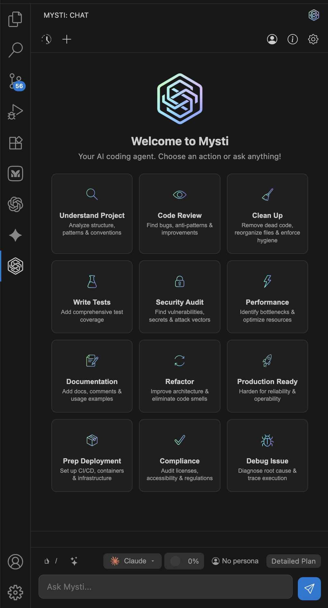
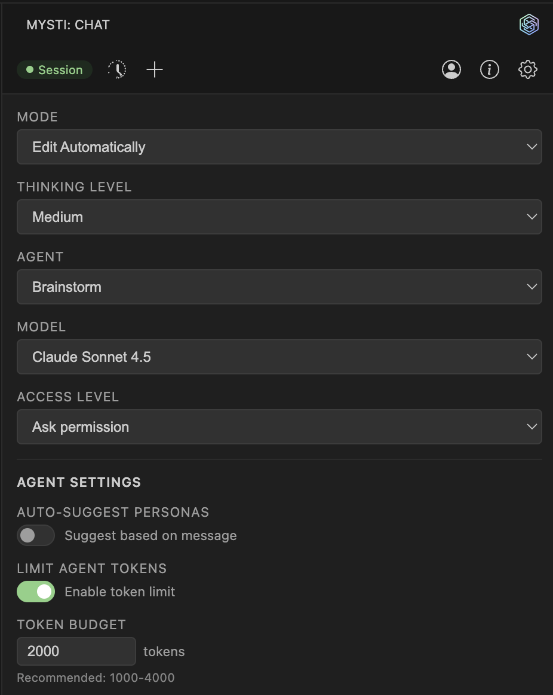

<p align="center">
  English | <a href="README.zh-CN.md">简体中文</a> | <a href="README.ja.md">日本語</a> | <a href="README.ko.md">한국어</a> | <a href="README.es.md">Español</a> | <a href="README.pt-BR.md">Português</a> | <a href="README.ar.md">العربية</a> | <a href="README.de.md">Deutsch</a> | <a href="README.fr.md">Français</a> | <a href="README.tr.md">Türkçe</a> | <a href="README.ru.md">Русский</a>
</p>

# Mysti - Your AI Coding Team Working Together

<p align="center">
  
</p>

<p align="center">
  <a href="https://marketplace.visualstudio.com/items?itemName=DeepMyst.mysti">
    
  </a>
  <a href="https://marketplace.visualstudio.com/items?itemName=DeepMyst.mysti">
    
  </a>
  <a href="https://marketplace.visualstudio.com/items?itemName=DeepMyst.mysti">
    
  </a>
  <a href="https://github.com/DeepMyst/Mysti/stargazers">
    
  </a>
  <a href="https://github.com/DeepMyst/Mysti/network/members">
    
  </a>
  <a href="https://github.com/DeepMyst/Mysti/blob/main/LICENSE">
    
  </a>
</p>

<p align="center">
  <strong>Your AI Coding team for VSCode</strong><br>
  <em>15 AI providers — Claude Code, Codex, Gemini, Copilot, Cline, Cursor, OpenClaw, OpenCode, Qwen Code, Ollama, LocalAI, Hermes, Continue, OpenRouter & Kimi Code — working solo or in teams</em><br>
  <em>Wisdom of the crowd where the collective intelligence of several agents outperforms a single one.</em>
</p>

<p align="center">
  <a href="https://marketplace.visualstudio.com/items?itemName=DeepMyst.mysti">
    
  </a>
</p>

<p align="center">
  <a href="#choose-your-ai">Providers</a> •
  <a href="#brainstorm-mode">Brainstorm</a> •
  <a href="#key-features">Features</a> •
  <a href="#quick-start">Quick Start</a> •
  <a href="#configuration">Config</a> •
  <a href="#documentation">Docs</a>
</p>

---

## Candidate compatibility

The current candidate registers **15 backends** with different execution limits.
Copilot is read/search only; Cursor and Continue reject approval-required and
read-only turns. Native bridges are limited to the versions and operations in
[the approval matrix](docs/APPROVAL_ACCEPTANCE_MATRIX.md). Account-backed,
cross-platform editor and two-machine Desk acceptance remain pending.

## Earlier release: v0.4.0

### 4 New Providers (12 Total)

Mysti now supports **12 AI providers** — added **OpenCode**, **Qwen Code**, **Ollama**, and **LocalAI** alongside Claude Code, Codex, Gemini, GitHub Copilot, Cline, Cursor, OpenClaw, and Manus. Run local models with Ollama/LocalAI or use cloud providers like OpenCode and Qwen Code. Each provider has its own authentic logo in the UI.

### Qwen Code

Alibaba's AI coding CLI with deep reasoning capabilities. Uses the same streaming protocol as Claude Code for seamless integration. Supports Qwen3 Coder models with plan, auto-edit, and yolo approval modes.

### OpenCode

Multi-backend coding agent supporting Anthropic, OpenAI, Google, and Groq through a single CLI. Uses your configured default model — no lock-in to specific providers.

### Local AI Support

Run AI models locally with **Ollama** and **LocalAI** — no cloud subscription needed. Inference runs on your configured server; network access and data handling depend on that deployment.

### Stability & Testing

18 stability fixes across brainstorm mode and @-mention tagging — silence-based timeouts, auth pre-checks, convergence guards, mention limits, and retry cleanup. Plus **360 automated tests** via vitest ensuring reliability across all features.

### Bug Fixes

- **Windows**: Fixed `spawn EINVAL` error with auto shell mode (#14)
- **Codex**: Brainstorm now respects `mysti.codexPath` setting (#26)

---

## Install in Seconds

**From VS Code:** Press `Ctrl+P` (`Cmd+P` on Mac), then paste:

```
ext install DeepMyst.mysti
```

**Or** [install from the VS Code Marketplace](https://marketplace.visualstudio.com/items?itemName=DeepMyst.mysti)

---

## Choose Your AI

Mysti connects the AI coding tools you already use through one interface.
Authentication, model availability and usage charges depend on the selected provider.

<p align="center">
  
</p>

| Provider | Best For |
|----------|----------|
| **Claude Code** | Deep reasoning, complex refactoring, thorough analysis |
| **Codex** | Quick iterations, familiar OpenAI style |
| **Gemini** | Fast responses, Google ecosystem integration |
| **GitHub Copilot** | Read/search through a configured BYOK endpoint |
| **Cline** | Plan/Act mode, structured task completion |
| **Cursor** | Auto model selection, multi-model with Claude, GPT-5, Gemini |
| **OpenClaw** | Real-time WebSocket streaming, configurable thinking levels |
| **OpenCode** | Multi-backend agent (Anthropic, OpenAI, Google, Groq) |
| **Qwen Code** | Alibaba's AI coding agent, deep reasoning |
| **Ollama** | Local LLM inference, privacy-first, no subscription |
| **LocalAI** | Self-hosted AI models, full control |
| **Hermes** | NousResearch's self-improving agent — skills, persistent memory, 300+ models via Nous Portal/OpenRouter |
| **Continue** | Open-source coding agent (cn CLI) — hub assistants, custom rules, any model |
| **OpenRouter** | Unified API to 300+ models (OpenAI-compatible) — free by default |
| **Kimi Code** | Moonshot AI's terminal coding agent (kimi CLI) — Kimi K2.7 Code / K3, up to 1M context, via ACP |

**Switch providers with one click. No lock-in.**

### Why Mysti?

| vs Copilot/Cursor | Mysti Advantage |
|-------------------|-----------------|
| Single AI | **Multi-agent brainstorming** — two AIs collaborate with 5 strategies |
| Locked to one provider | **15 providers** — Claude, Codex, Gemini, Copilot, Cline, Cursor, OpenClaw, OpenCode, Qwen, Ollama, LocalAI, Hermes, Continue, OpenRouter, Kimi Code |
| Black box | **Full permission control** — read-only to full-access |
| Generic responses | **16 personas** — architect, debugger, security expert... |
| Manual workflow | **Autonomous mode** — AI works independently with safety controls |
| No cross-agent routing | **@-mentions** — route tasks to specific agents inline |

---

## See It In Action

<p align="center">
  
</p>

<p align="center"><em>Beautiful, modern chat interface with syntax highlighting, markdown support, and mermaid diagrams</em></p>

<p align="center">
  
</p>

<p align="center"><em>Real-time task list rendering and progress tracking</em></p>

---

## Brainstorm Mode

**Want a second opinion?** Enable Brainstorm Mode and let two AI agents tackle your problem together. **Choose any 2 of 12 agents** from the settings panel.

<p align="center">
  
</p>

### 5 Collaboration Strategies

| Strategy | Roles | Best For |
|----------|-------|----------|
| **Quick** | Direct synthesis | Simple tasks, fast answers |
| **Debate** | Critic vs Defender | Architecture decisions, trade-offs |
| **Red-Team** | Proposer vs Challenger | Security reviews, edge case discovery |
| **Perspectives** | Risk Analyst vs Innovator | Greenfield design, technology selection |
| **Delphi** | Facilitator vs Refiner | Complex problems, reaching consensus |

### Why Two AIs Beat One

**Claude Code** (Anthropic), **Codex** (OpenAI), **Gemini** (Google), **GitHub Copilot**, **Cline**, **Cursor**, **OpenClaw**, **OpenCode**, **Qwen Code** (Alibaba), **Ollama**, and **LocalAI** have different training, different strengths, and different blind spots. When any two work together:

- Each AI catches edge cases the other might miss
- Different perspectives lead to more robust solutions
- **Together** they debate, challenge each other, and synthesize the best solution

It's like having a senior dev and a tech lead review your code—except they actually discuss it first.

### Convergence Detection

During discussions, Mysti tracks agent agreement and position stability. When **auto-convergence** is enabled, the discussion exits early once agents reach consensus — saving time without sacrificing quality.

### Choose Your Team

Configure which two agents collaborate in the **Settings Panel**:

<p align="center">
  
</p>

| Combination | Best For |
|-------------|----------|
| Claude + Codex | Deep analysis meets rapid iteration |
| Claude + Gemini | Thorough reasoning with fast validation |
| Claude + Copilot | Compare native Claude vs Copilot's multi-model approach |
| Cursor + Gemini | Multi-model flexibility with Google integration |
| OpenClaw + Claude | WebSocket streaming with deep reasoning |
| Qwen + Claude | Compare Alibaba and Anthropic reasoning |
| OpenCode + Gemini | Multi-backend flexibility with Google speed |
| Ollama + Claude | Local privacy meets cloud intelligence |

[Full Brainstorm documentation](docs/BRAINSTORM.md)

### Intelligent Plan Detection

When the AI presents multiple implementation approaches, Mysti automatically detects them and lets you choose your preferred path.

<p align="center">
  
</p>

*Requires at least 2 CLI tools installed. See [Requirements](#requirements).*

---

## Key Features

### Autonomous Mode

Let the AI work independently with configurable safety controls:

- **Safety Classifier**: Three levels — safe (auto-approve), caution (mode-dependent), blocked (always deny)
- **Three Safety Modes**: Conservative, Balanced, Aggressive
- **Learning Memory**: Remembers your permission preferences and improves over time
- **Continuation Modes**: Goal-based or task-queue for extended autonomous sessions
- **Audit Trail**: Every autonomous decision is logged for review

<p align="center">
  
</p>

[Full Autonomous Mode documentation](docs/AUTONOMOUS-MODE.md)

### @-Mention System

Route tasks to specific agents and reference files inline:

<p align="center">
  
</p>

```
@claude Review this code for security issues
@src/auth.ts @gemini Suggest performance improvements for this file
@claude Write tests, then @codex optimize them
```

- **File mentions**: `@filename` adds transient context
- **Agent mentions**: `@agent` routes tasks to that provider
- **Chaining**: Later agents receive earlier agents' responses as context

[Full @-Mention documentation](docs/MENTIONS.md)

### Context Compaction

Smart conversation management that prevents context overflow:

- **Automatic**: Triggers when token usage approaches the threshold (default 75%)
- **Native support**: Claude Code uses built-in `/compact` command
- **Client-side**: Other providers use intelligent message summarization
- **Per-panel tracking**: Each chat panel tracks usage independently

[Full Compaction documentation](docs/COMPACTION.md)

### 16 Developer Personas

Shape how your AI thinks. Select from specialized personas that change the AI's approach to your problems.

<p align="center">
  
</p>

| Persona | Focus |
|---------|-------|
| **Architect** | System design, scalability, clean structure |
| **Debugger** | Root cause analysis, bug fixing |
| **Security-Minded** | Vulnerabilities, threat modeling |
| **Performance Tuner** | Optimization, profiling, latency |
| **Prototyper** | Quick iteration, PoCs |
| **Refactorer** | Code quality, maintainability |
| + 10 more... | Full-Stack, DevOps, Mentor, Designer... |

[Full Personas & Skills documentation](docs/PERSONAS-AND-SKILLS.md)

---

### Quick Persona Selection

Select personas directly from the toolbar without opening panels.

<p align="center">
  
</p>

---

### Smart Auto-Suggestions

Mysti automatically suggests relevant personas and actions based on your message.

<p align="center">
  
</p>

---

### Conversation History

Never lose your work. All conversations are saved and easily accessible.

<p align="center">
  
</p>

---

### Quick Actions on Welcome

Get started fast with one-click actions for common tasks.

<p align="center">
  
</p>

---

### Extensive Settings

Fine-tune every aspect of Mysti including token budgets, access levels, and brainstorm mode.

<p align="center">
  
</p>

---

## Requirements

Use a VS Code version supported by `engines.vscode` in [package.json](package.json)
and configure a supported backend. Check that backend's authentication and usage
requirements; subscription access and API access may differ.

| Backend | Authentication | Install |
|----------|--------------|---------|
| **Claude Code** (recommended) | Anthropic API or Claude Pro/Max | `npm install -g @anthropic-ai/claude-code@2.1.266` |
| **GitHub Copilot CLI** | BYOK endpoint, model and API key; subscription login unsupported | `npm install -g @github/copilot@1.0.83` |
| **Gemini CLI** | API key, Vertex AI or Code Assist Standard/Enterprise sign-in | `npm install -g @google/gemini-cli@0.58.0` |
| **Codex CLI** | Supported ChatGPT sign-in or OpenAI API | `npm install -g @openai/codex@0.153.4` |
| **Cline** | `CLINE_API_KEY` in the extension environment | `npm install -g cline@3.0.61` |
| **Cursor** | Cursor subscription | macOS/Linux: `curl https://cursor.com/install -fsS \| bash` · Windows: `irm 'https://cursor.com/install?win32=true' \| iex` |
| **OpenClaw** | Configured provider/model and matching credentials; POSIX runtime | `npm install -g openclaw@2026.6.34` |
| **OpenCode** | Provider API keys (Anthropic, OpenAI, etc.) | `npm i -g opencode-ai@1.18.29` |
| **Qwen Code** | Qwen OAuth or API keys | `npm install -g @qwen-code/qwen-code@0.23.0` |
| **Ollama** | Local (no subscription needed) | [Install from ollama.com](https://ollama.com) |
| **LocalAI** | Local (no subscription needed) | [Docker / binaries](https://localai.io/basics/getting_started/) |

Configure **one** supported backend to get started. Brainstorm uses **two**
available agents. HTTP providers such as OpenRouter do not require a provider CLI.
Pinned CLI versions match Mysti's verified native approval contracts; see
[provider support and limits](docs/PROVIDERS.md) before updating independently.

---

## Quick Start

### 1. Install Mysti

**Option A:** Press `Ctrl+P` (`Cmd+P` on Mac), paste and run:
```
ext install DeepMyst.mysti
```

**Option B:** [Install from VS Code Marketplace](https://marketplace.visualstudio.com/items?itemName=DeepMyst.mysti)

### 2. Configure a Backend

Choose one supported backend. For a CLI backend, install its verified version:

```bash
# Claude Code (recommended)
npm install -g @anthropic-ai/claude-code@2.1.266
claude auth login

# Or Codex
npm install -g @openai/codex@0.153.4
codex login

# Or GitHub Copilot CLI (BYOK, read/search only)
npm install -g @github/copilot@1.0.83
# Configure COPILOT_PROVIDER_BASE_URL and its model/API key in the extension environment.

# Or Gemini CLI
npm install -g @google/gemini-cli@0.58.0
gemini

# Or Cline
npm install -g cline@3.0.61
# Set CLINE_API_KEY in the extension environment.

# Or Cursor (macOS/Linux; on Windows PowerShell: irm 'https://cursor.com/install?win32=true' | iex)
curl https://cursor.com/install -fsS | bash
agent login

# Or OpenClaw (POSIX)
npm install -g openclaw@2026.6.34
# Configure agents.defaults.model and matching provider credentials in OpenClaw.

# Or OpenCode
npm i -g opencode-ai@1.18.29
# Set the selected provider's API key in the extension environment.
# Set mysti.opencodeModel to an explicit provider/model ID.

# Or Qwen Code
npm install -g @qwen-code/qwen-code@0.23.0
qwen  # then type /auth
```

Copilot requires BYOK configuration; GitHub tokens and subscription logins are
unsupported, and writes and shell commands are disabled. OpenCode uses provider
API keys rather than saved CLI logins and refuses startup when its configuration
exists in the workspace or an ancestor. See [provider setup and limits](docs/PROVIDERS.md).

HTTP backends do not require a provider CLI. Configure two available agents for
Brainstorm Mode.

### 3. Open Mysti

- Click the **Mysti icon** in the Activity Bar, or
- Press `Ctrl+Shift+M` (`Cmd+Shift+M` on Mac)

### 4. Start Coding

Type your request and let the AI assist you!

---

## Slash Commands

Access skills and actions quickly with the built-in slash command menu.

<p align="center">
  
</p>

---

## 12 Toggleable Skills

Mix and match behavioral modifiers:

- **Concise** - Clear, brief communication
- **Test-Driven** - Tests alongside code
- **Auto-Commit** - Incremental commits
- **First Principles** - Fundamental reasoning
- **Scope Discipline** - Stay focused on the task
- And 7 more...

[Full Personas & Skills documentation](docs/PERSONAS-AND-SKILLS.md)

---

## Permission Controls

Stay in control of what the AI can do:

- **Read-only** - AI can only read, never modify
- **Ask-permission** - Approve each file change
- **Full-access** - Let the AI work autonomously

<p align="center">
  
</p>

---

## Configuration

### Essential Settings

```json
{
  "mysti.defaultProvider": "claude-code",
  "mysti.brainstorm.agents": ["claude-code", "google-gemini"],
  "mysti.brainstorm.strategy": "quick",
  "mysti.accessLevel": "ask-permission"
}
```

### Provider Settings

| Setting | Default | Description |
|---------|---------|-------------|
| `mysti.defaultProvider` | `claude-code` | Primary AI provider |
| `mysti.claudeCodePath` | `claude` | Path to Claude CLI |
| `mysti.codexPath` | `codex` | Path to Codex CLI |
| `mysti.geminiPath` | `gemini` | Path to Gemini CLI |
| `mysti.copilotPath` | `copilot` | Path to Copilot CLI |
| `mysti.clinePath` | `cline` | Path to Cline CLI |
| `mysti.cursorPath` | `agent` | Path to Cursor CLI |
| `mysti.openclawPath` | `openclaw` | Path to OpenClaw CLI |
| `mysti.opencodePath` | `opencode` | Path to OpenCode CLI |
| `mysti.qwenCodePath` | `qwen` | Path to Qwen Code CLI |
| `mysti.ollamaEndpoint` | `http://localhost:11434` | Ollama HTTP endpoint |
| `mysti.localaiEndpoint` | `http://localhost:8080` | LocalAI HTTP endpoint |

### Brainstorm Settings

| Setting | Default | Description |
|---------|---------|-------------|
| `mysti.brainstorm.agents` | `["claude-code", "openai-codex"]` | Which 2 agents to use |
| `mysti.brainstorm.strategy` | `quick` | Strategy: `quick`, `debate`, `red-team`, `perspectives`, `delphi` |
| `mysti.brainstorm.autoConverge` | `true` | Auto-exit when agents converge |
| `mysti.brainstorm.maxDiscussionRounds` | `2` | Maximum discussion rounds |

### Autonomous Settings

| Setting | Default | Description |
|---------|---------|-------------|
| `mysti.autonomous.safetyMode` | `balanced` | `conservative`, `balanced`, `aggressive` |
| `mysti.autonomous.blockPatterns` | `[]` | Custom patterns to always block |

### Compaction Settings

| Setting | Default | Description |
|---------|---------|-------------|
| `mysti.compaction.enabled` | `true` | Enable context compaction |
| `mysti.compaction.threshold` | `75` | Compaction threshold (% of context window) |

### General Settings

| Setting | Default | Description |
|---------|---------|-------------|
| `mysti.accessLevel` | `ask-permission` | File access level |
| `mysti.agents.autoSuggest` | `true` | Auto-suggest personas |
| `mysti.agents.maxTokenBudget` | `0` | Max tokens for agent context (0 = unlimited) |

[Full Provider documentation](docs/PROVIDERS.md)

---

## Keyboard Shortcuts

| Action | Windows/Linux | Mac |
|--------|---------------|-----|
| Open Mysti | `Ctrl+Shift+M` | `Cmd+Shift+M` |
| Open in New Tab | `Ctrl+Shift+N` | `Cmd+Shift+N` |

---

## Commands

| Command | Description |
|---------|-------------|
| `Mysti: Open Chat` | Open the chat sidebar |
| `Mysti: New Conversation` | Start fresh |
| `Mysti: Add to Context` | Add file/selection to context |
| `Mysti: Clear Context` | Clear all context |
| `Mysti: Open in New Tab` | Open chat as editor tab |

---

## Documentation

| Guide | Description |
|-------|-------------|
| [Providers](docs/PROVIDERS.md) | Provider setup, models and features |
| [Brainstorm Mode](docs/BRAINSTORM.md) | 5 strategies, convergence, team selection |
| [Personas & Skills](docs/PERSONAS-AND-SKILLS.md) | 16 personas, 12 skills, custom agents |
| [Autonomous Mode](docs/AUTONOMOUS-MODE.md) | Safety system, memory, continuation modes |
| [@-Mentions](docs/MENTIONS.md) | Agent routing and file context |
| [Compaction](docs/COMPACTION.md) | Context management and summarization |
| [Architecture](docs/ARCHITECTURE.md) | Technical internals and extension points |
| [Maintenance](docs/MAINTENANCE.md) | Development checks, dependency updates and release verification |
| [Features](docs/FEATURES.md) | Complete feature reference |

---

## Telemetry

Mysti collects **anonymous** usage data to improve the extension:

- Feature usage patterns
- Error rates
- Provider preferences

**No code, file paths, or personal data is ever collected.**

Respects VSCode's telemetry setting. Disable via:
Settings > Telemetry: Telemetry Level > off

---

## Contributors

Thanks to everyone who has helped make Mysti better!

<a href="https://github.com/BahaAbuNojaim"></a>
<a href="https://github.com/MostlyKIGuess"></a>
<a href="https://github.com/a-programmers-programmer"></a>
<a href="https://github.com/patrick-fu"></a>
<a href="https://github.com/3em0"></a>

Want to join them? Check out the [Contributing](#contributing) section below.

---

## Star History

If Mysti has been useful to you, consider giving it a star — it helps others discover the project and keeps us motivated!

<p align="center">
  <a href="https://github.com/DeepMyst/Mysti/stargazers">
    
  </a>
</p>

<p align="center">
  <a href="https://star-history.com/#DeepMyst/Mysti&Date">
    
  </a>
</p>

---

## Contributing

We welcome contributions! Whether it's bug reports, feature requests, or code contributions.

- **Good First Issues**: Look for [`good first issue`](https://github.com/DeepMyst/Mysti/labels/good%20first%20issue) labels
- **Development**: Use Node from `.nvmrc`, run `npm ci` and `npm run watch`, then press `F5` in VS Code
- **Pull Requests**: Fork, create a feature branch, and submit a PR

See [CONTRIBUTING.md](CONTRIBUTING.md) for detailed guidelines.

---

## License

Apache License 2.0 — free to use, modify, and distribute, including for commercial purposes.
See the `LICENSE` file for full text.


---

<p align="center">
  <a href="https://marketplace.visualstudio.com/items?itemName=DeepMyst.mysti">Install</a> •
  <a href="https://github.com/DeepMyst/Mysti/issues">Report Issue</a> •
  <a href="https://github.com/DeepMyst/Mysti">GitHub</a>
</p>

<p align="center">
  <strong>Mysti</strong> — Built by <a href="https://www.deepmyst.com/mysti">DeepMyst Inc</a><br>
  <sub>Made with Mysti</sub>
</p>
