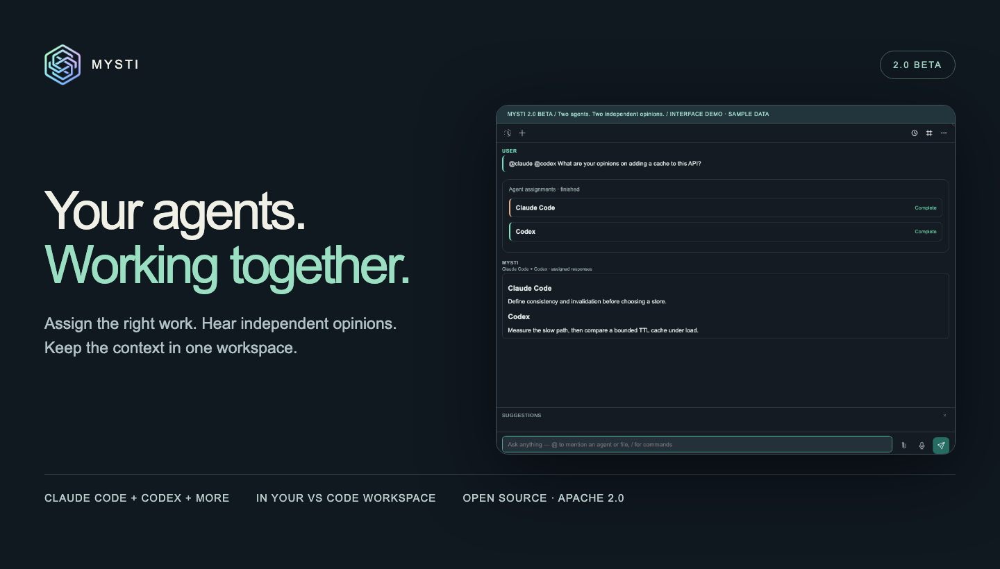
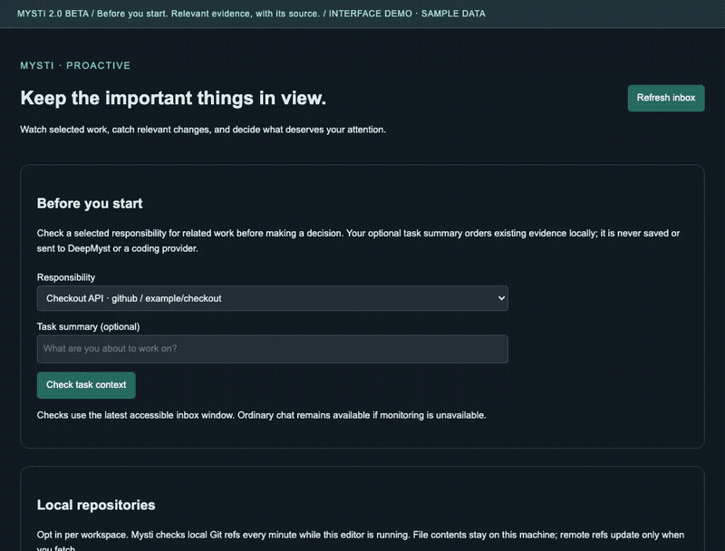
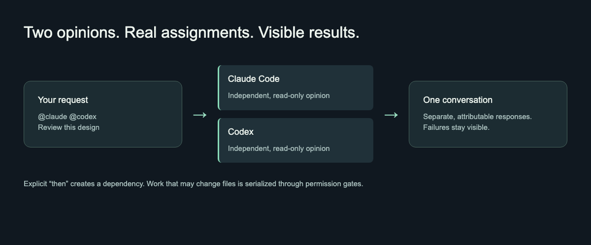

<p align="center">
  <a href="https://marketplace.visualstudio.com/items?itemName=DeepMyst.mysti">Install Mysti</a> ·
  <a href="docs/GETTING-STARTED.md">Get started</a> ·
  <a href="docs/releases/2.0-beta/RELEASE-NOTES.md">2.0 BETA release notes</a> ·
  <a href="CONTRIBUTING.md">Contribute</a>
</p>



# Mysti 2.0 BETA

**An open-source coding workspace that brings your agents together inside VS Code.**

Ask Claude Code and Codex for independent opinions. Give a specialist a specific task. Hand completed work to another agent for review. Keep their responses, context, permissions, and progress in one conversation.

Mysti connects the coding tools you choose—CLI agents, local model servers, and the DeepMyst-powered Mysti coordinator. Use one agent when that's enough; bring in more when another perspective helps.

[](https://github.com/DeepMyst/Mysti/actions/workflows/ci.yml)
[](https://marketplace.visualstudio.com/items?itemName=DeepMyst.mysti)
[](LICENSE)

> **2.0 is a beta.** This checkout prepares the 2.0.0 pre-release package. The Marketplace badge shows the currently published version. See [release status and limitations](docs/releases/2.0-beta/RELEASE-NOTES.md) before adopting it for important work.

## See it work

[**Watch the product tour →**](https://github.com/DeepMyst/Mysti/blob/main/docs/releases/2.0-beta/mysti-2-beta-tour.mp4)

The recordings below use the **shipped webviews with deterministic sample responses**. They demonstrate interaction and presentation; they are not live provider runs or performance benchmarks. [Capture details and video downloads](docs/releases/2.0-beta/README.md).

### Ask two agents. Hear from both.

```text
@claude @codex What are your opinions on adding a cache to this API?
```

Explicit tags determine who does the work. Independent read-only assignments run concurrently within the configured limit. Each agent has its own live card and attributed answer—even if one of them is already your selected provider.


A failed participant stays visible. Mysti does not invent its answer or quietly ask the other agent to impersonate it.

### Keep model choices close to your work

Choose the model, adjust effort, and toggle Ultracode where the provider supports it. The model menu and action menu share the same settings. Dictation adds text to your draft for review before you send.


### Get context before you start

Proactive brings selected local Git changes and DeepMyst-connected GitHub/Slack evidence into an inbox. The **Before you start** view helps you inspect relevant evidence for a responsibility, including source links and freshness information.



Cloud monitoring requires DeepMyst sign-in, a supported connection, and an explicitly configured responsibility. Coverage is bounded; evidence does not prove who owns a task. [Proactive setup and limits](docs/PROACTIVE.md).

## One workspace, several ways to work

| When you need… | Use… | What happens |
| --- | --- | --- |
| A direct answer or implementation | A selected provider, or `@claude` / `@codex` | The named agent handles the request with your access settings. |
| Independent perspectives | `@claude @codex` with a question or review request | Read-only assignments run concurrently; results remain separately attributed. |
| An ordered handoff | `@claude Write the parser, then @codex review it` | The reviewer receives the completed result as reference material. A failed dependency blocks the handoff. |
| A defined perspective | `@claude:critic @codex:reviewer` | Catalog roles shape each response and restrict its access. |
| A structured discussion | Brainstorm | Choose a team and discussion strategy, then follow its rounds and synthesis. |
| A coordinating agent | Mysti | A DeepMyst-backed coordinator can answer, use configured tools, and delegate through permission gates. |
| Visual iteration | Canvas and Visual Test | Work with visual artifacts and inspect a running app; browser setup may be required. |
| Project-specific practices | Personas, skills, and roles | Reuse your team's guidance with explicit trust and access boundaries. |



Parallelism follows the work: independent advisory requests may overlap; writers share a workspace and run serially. Use **then** for an explicit dependency. [Assignment syntax and troubleshooting](docs/MENTIONS.md).

## Get started

1. **Install Mysti** from the [VS Code Marketplace](https://marketplace.visualstudio.com/items?itemName=DeepMyst.mysti), or install the reviewed beta VSIX with **Extensions → Install from VSIX**. Choose the pre-release channel when 2.0 BETA is published.
2. **Open a trusted local workspace.** Mysti supports VS Code 1.86 or newer on Windows, macOS, and Linux. Native voice support and provider CLIs have their own host requirements.
3. **Open Mysti and choose your agent.** The setup screen checks installation and authentication and provides the supported install, upgrade, or sign-in action. Mysti itself uses your DeepMyst account; CLI agents use their own credentials.
4. **Start with a small task.** Try `@claude Explain the main entry point`, then add `@codex` for a second opinion when both are configured.

You only need **one** configured agent to begin. Provider subscriptions, API access, usage charges, and supported models vary. [Getting started](docs/GETTING-STARTED.md) · [Provider setup](docs/PROVIDERS.md).

## Bring your preferred agents

| Provider family | Available adapters |
| --- | --- |
| Coding agents | Claude Code, OpenAI Codex, Google Gemini CLI, GitHub Copilot CLI, Cline, Cursor |
| Additional coding tools | OpenClaw, OpenCode, Qwen Code, Hermes, Continue, Kimi Code |
| Local / API endpoints | Ollama, LocalAI, OpenRouter, MiniMax |
| Mysti coordinator | DeepMyst account, with optional configured local execution and delegation |

The UI follows each adapter's capabilities. Model availability, effort, Ultracode, attachments, native approvals, and authentication are provider-specific. An adapter being included is not a claim that every provider/version/account combination has been live-tested. [Compatibility and setup](docs/PROVIDERS.md).

## Your context and your controls

- **Context where it belongs:** mention workspace files, inspect diagnostics with `@problems`, or add a Git summary with `@git`.
- **Visible authority:** read-only and approval modes, agent-specific tool activity, and cancellation across active assignments.
- **Continuity:** conversation history, context compaction, and workspace checkpoints for supported local changes.
- **Explicit connections:** choose the DeepMyst tools and sources used by connected features. Cloud responsibilities continue on the backend; local Git watches need the editor running.

Provider requests transmit the prompt and supplied context to the configured provider. DeepMyst features use your connected account. Telemetry follows VS Code's telemetry setting; see the [security policy](.github/SECURITY.md) and feature-specific guides. A local checkpoint cannot undo an external action.

## Explore the documentation

| Guide | What it covers |
| --- | --- |
| [Start here](docs/GETTING-STARTED.md) | Install, configure, send your first task, troubleshoot |
| [Agent assignments](docs/MENTIONS.md) | Tags, roles, parallel reviews, dependent handoffs |
| [Providers](docs/PROVIDERS.md) | Installation, authentication, models, capability differences |
| [Feature guide](docs/FEATURES.md) | Chat, menus, dictation, Canvas, permissions and more |
| [Brainstorm](docs/BRAINSTORM.md) | Team discussion and synthesis |
| [Personas and skills](docs/PERSONAS-AND-SKILLS.md) | Reusable project practices |
| [Proactive](docs/PROACTIVE.md) | Responsibilities, evidence, notification and coverage limits |
| [Architecture](docs/ARCHITECTURE.md) | Host, webview, routing and provider boundaries |
| [Release notes](docs/releases/2.0-beta/RELEASE-NOTES.md) | What's new, migration, known limitations |
| [Contributing](CONTRIBUTING.md) | Development, meaningful tests, demos and release work |

**Translations:** [العربية](README.ar.md) · [中文](README.zh-CN.md) · [日本語](README.ja.md) · [한국어](README.ko.md) · [Español](README.es.md) · [Português](README.pt-BR.md) · [Deutsch](README.de.md) · [Français](README.fr.md) · [Türkçe](README.tr.md) · [Русский](README.ru.md). Community translations may describe an earlier release; this README is the current 2.0 BETA reference.

## Build with us

Mysti is Apache-2.0 licensed. Useful contributions include reproducible routing bugs, native-provider compatibility checks, accessible UI improvements, and tested documentation corrections.

```sh
npm ci
npm run typecheck
npm test
npm run watch
```

Use the Node version in `.nvmrc`; press **F5** to launch the extension development host. See [CONTRIBUTING.md](CONTRIBUTING.md) for provider contracts, browser tests, and contribution expectations.

[Report a bug](https://github.com/DeepMyst/Mysti/issues/new/choose) · [Discuss an idea](https://github.com/DeepMyst/Mysti/issues) · [View the roadmap](plans/README.md)

## Contributors

Thanks to everyone who has helped make Mysti better!

<a href="https://github.com/BahaAbuNojaim"></a>
<a href="https://github.com/MostlyKIGuess"></a>
<a href="https://github.com/a-programmers-programmer"></a>
<a href="https://github.com/patrick-fu"></a>
<a href="https://github.com/3em0"></a>

Want to join them? Check out the [contribution guide](CONTRIBUTING.md) section below.

---

## License

[Apache License 2.0](LICENSE). Built by [DeepMyst](https://www.deepmyst.com/mysti) and the Mysti community. Provider names and trademarks belong to their respective owners.
