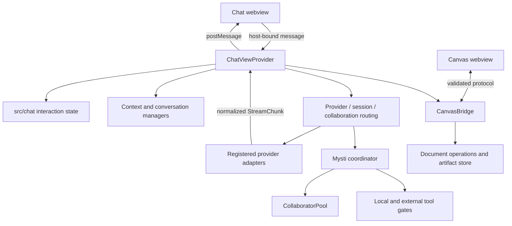

# Mysti architecture

This document describes the source checkout. Historical release notes and design
proposals under `plans/` are not evidence that a feature is shipped or fully wired.
See [maintenance](MAINTENANCE.md) for verification and release work.

## Runtime boundaries

Mysti is a VS Code extension with three distinct execution environments:

| Environment | Entry | Responsibilities |
| --- | --- | --- |
| Extension host | `src/extension.ts` → `dist/extension.js` | VS Code integration, provider processes, storage, permission decisions and network clients. |
| Chat webview | `src/webview/webviewContent.ts` + `media/chat/` | Rendering and user interaction. Messages cross the host boundary; browser state does not own authority. |
| Canvas webview | `src/webview/canvas/index.ts` → `dist/canvasWebview.js` | Document rendering, selection, inspector and live frames. Compiled for the browser, without Node or VS Code externals. |

The host bundle externalizes VS Code and Playwright. Playwright's JavaScript
runtime must ship in the VSIX; browser executables are installed separately.
The Canvas bundle uses ESM internally so webpack can remove unused host paths.
Do not import a host service into browser code merely to reuse one helper.

## Module map

| Area | Main modules | Ownership |
| --- | --- | --- |
| Composition | `src/extension.ts`, `ChatViewDependencies` | Construct named dependencies and register commands, webviews and disposables. Chat services are passed by name so additions cannot transpose positional arguments. |
| Chat host adapter | `src/providers/ChatViewProvider.ts` | Connect UI events to application services and stream updates back to a panel. This remains a large legacy controller; extract cohesive behavior as it changes. |
| Chat interactions | `src/chat/` | Host-independent panel identity binding, sub-agent answer ownership, pending plans and delayed channel turns. These modules do not import VS Code or the host controller. |
| Markdown and diagrams | `media/chat/markdownRenderer.js` | A private Marked parser, HTML sanitization, code/diff formatting and lazy Mermaid rendering. The chat shell supplies local libraries/resource URI and disposes the renderer; stale or detached renders cannot replace current content. |
| Sub-agent cards | `media/chat/subAgentCards.js` | Per-attempt card state, text, tools, questions and timers. Full agent IDs route events; opaque DOM IDs and direct element references prevent selector and display-name collisions. |
| Coordinator output | `src/chat/CoordinatorRunOutput.ts` | One run's foreground/background delivery, ordered replay record, actual model attribution and usage receipt. It receives a message sink and clock rather than a webview or manager. |
| Provider contract | `src/providers/base/IProvider.ts`, `ProviderManifest.ts`, `src/providers/ProviderRegistry.ts` | Transport contract, capability declarations, display/model metadata and registration. |
| CLI transport | `src/providers/base/BaseCliProvider.ts`, `prepareCliAttachments.ts`, `src/utils/platform.ts`, `processKill.ts` | Discovery, per-request cancellation, process identity, streaming and temporary attachment ownership. Cleanup acts only on its captured process and files. |
| Coordinator streams | `src/coordinator/CoordinatorTurnRunner.ts` | Model round-trip limits, scanner continuity across length continuations, stream cancellation and a single final answer attempt without tools. The caller provides transport and output ports; the runner has no VS Code dependency. |
| Coordinator tools | `CoordinatorModelClient`, `coordinatorTools`, `MystiTagScanner`, `ChatViewProvider._runMystiAgentic` | Model selection, native tools or nonce-fenced directives, gated tool execution and tool-result framing. Tool budgets and dispatch remain in the host controller. |
| Collaboration | `BrainstormManager`, `SessionManager`, `MentionRouter`, `CollaborationManager`, `MystiOrchestratorManager`, `CollaboratorPool` | Separate collaboration shapes, routing and bounded child execution. They are different workflows, not interchangeable names. |
| Context and history | `ContextManager`, `ConversationManager`, `CompactionManager`, `SmartCompactor`, `TokenAccounting` | Context collection, schema-versioned persistence, compaction and normalized context/spend measurements. |
| Canvas document | `src/canvas/doc/`, `CanvasHistory`, `CanvasBridge`, `CanvasOpExecutor`, `ArtifactStore` | Typed document changes, conflict handling, undo, synchronization and persistence. |
| Visual observation | `visualTestPolicy`, `VisualSessionManager`, `BrowserManager` | Resolve allowed origins and dev-server policy, then inspect the running application. |
| External connections | `DeepMystAuthManager`, `DeepMystClient`, `McpClient`, `McpConfigManager` | Secret storage, account connection, brokered tools and optional per-user CLI configuration. |
| Desk | `src/services/desk/`, `DeskPairingFlow`, `DeskPeerBook` | Peer identity, pairing and grants. Additional transport/dispatch modules exist; source presence alone does not establish end-to-end task execution. |

## A chat turn

1. The host binds an incoming message to the webview that sent it. A browser's
   `panelId` cannot redirect the message to another panel. Each action still
   validates its own payload at the runtime boundary.
2. The controller resolves the panel's provider/model, clamps workspace settings
   against user policy, and normalizes authority values.
3. Context, conversation history and a checkpoint are prepared. Provider choice
   and agent selection are distinct: `mysti` is a coordinator selection, not a
   concrete CLI provider.
4. Routing selects a backend, Mysti, a session shape, mentions or collaboration.
   Provider adapters emit normalized `StreamChunk` events.
5. The host handles tools, questions, usage and terminal events, forwards UI
   updates, and persists the response in that panel's conversation.

Provider instances may be shared. Mutable conversation/process state belongs to
the panel or run, never to a singleton field reused across panels. Sub-agent
question identity is the tuple `(panelId, agentId, deliveryId)`, not a concatenated
string or a backend tool ID alone. Each UI delivery gets a fresh ID; cancelled
turns invalidate their callbacks so an old card cannot answer a newer question.
Cancelling or closing a panel settles its pending questions and plans without
affecting another panel. Async plan detection checks its captured scope before
publishing or executing anything after an await.

Permission replies must match the host-bound panel that owns the request. A
decision that settles after a conversation change cannot resume or cancel the
replacement process. Queued channel input forms one ordered turn containing each
message and its source; arrivals during the short delay join that batch. Stop,
manual replacement and conversation changes clear only that panel's queued input.
Automatic follow-ups yield to queued input and cannot restart cancelled work.

Foreground runs own their children and abort signals. Cancellation is terminal:
a strategy must not start synthesis or fallback after Stop, and an abandoned
stream must release its children. Durable background jobs have a separate
lifetime and may survive closing a tab; pending permission cards in that tab must
still be denied so they cannot leave a job blocked forever.

## Provider integration

The registry currently contains Claude Code, Codex, Gemini, Cline, Copilot,
Cursor, OpenClaw, OpenCode, Qwen Code, Ollama, LocalAI, Hermes, Continue,
OpenRouter and Kimi Code. `ManusProvider.ts` is legacy and unregistered.

CLI, persistent ACP and HTTP transports expose different capabilities. Declare
those differences in provider metadata and consume that metadata in the UI.
Do not infer support from a provider name or assume interactive CLI commands
also work through the headless entry point. Parse external responses as
`unknown`, narrow fields, and preserve missing measurements as unknown.

`TokenAccounting` is the shared accounting boundary. Current context occupancy
and cumulative spend are different values; cache conventions differ by backend.
Use the shared normalization functions instead of reconstructing token math in
the renderer or another adapter.

`CoordinatorRunOutput` owns the coordinator's accumulated prose, reasoning and
tool records. The coordinator loop feeds metadata before scanning text so a tool
directive cannot discard usage delivered in the same event. Interrupted turns
estimate output only when no measured usage arrived; the receipt distinguishes
those estimates from measurements. Persistence uses detached snapshots, so an
incomplete-run marker cannot mutate output still owned by the run.
Each new model stream invalidates the previous context-size measurement. A run
with any unmeasured stream reports partial usage even if another stream supplies
measurements; an earlier prompt size must not be presented as the current fill.

Follow the provider checklist in [CONTRIBUTING.md](../CONTRIBUTING.md). A normal
adapter change needs fixture-based parsing, arguments, permissions, cancellation
and capability tests; record the CLI version used for live verification.

## Authority and persistence

- Workspace configuration may lower user authority. It must not raise it.
- The host authorizes operations. A tool event or permission card is not proof
  that a backend waited for approval before acting; validate the native transport
  before making that guarantee.
- Model directives and external results pass through existing nonce validation,
  redaction and untrusted-result framing. New dispatch paths must use those same
  boundaries.
- Coordinator local execution, visual interaction and external tools each have
  their own settings and policy gates. The coordinator does have optional local
  write/shell tools; describing it as universally read-only is incorrect.
- Canvas client messages pass through the typed protocol and a per-view token.
  Authors are assigned host-side. Filesystem access and exported assets remain
  subject to the Canvas policy boundary.
- DeepMyst credentials use SecretStorage and restricted destination hosts.
  Enabling CLI MCP integration also writes credentials into per-user CLI config;
  those paths must not be logged or included in exports.
- Conversation and artifact formats are versioned. Preserve unreadable and
  future-version data rather than overwriting it during a downgrade. Test
  migration with stored fixtures and failure cases before changing a schema.
  Conversation recovery must acknowledge a successful backup before saving over
  the live key. A failed backup disables saves; restored entries are detached
  from the protected original. Duplicate keys preserve the complete original
  input for recovery instead of silently discarding a transcript.

## Keeping modules maintainable

Keep new application behavior outside `ChatViewProvider` and `media/chat/chat.js`
when it can have a coherent API and independent tests. Extract state together
with the operations that own it; moving helpers while leaving shared mutable
maps in the controller does not establish a boundary.

Prefer narrow constructor dependencies or callbacks for VS Code, clocks, storage
and transport. Pure logic should be importable without constructing the extension.
The `src/chat/` modules demonstrate this approach for interaction ownership.
Do not introduce a framework or a new dependency merely to hold a small interface.

The old `CanvasManager`/direct `StitchService` startup pair has no consumers in
the active Canvas surface and is no longer constructed at activation. Their
legacy source and tests remain; active Canvas uses the typed bridge, artifact
store and capability broker described above. Do not reintroduce an unused
singleton to make an old dependency list look complete.

During extraction, preserve public messages, saved formats and lifecycle
behavior. Add tests for cross-panel isolation, aborts, malformed inputs and
resource cleanup at the seam. Source-text assertions can check registration or
packaging, but application behavior should be tested by executing it.
