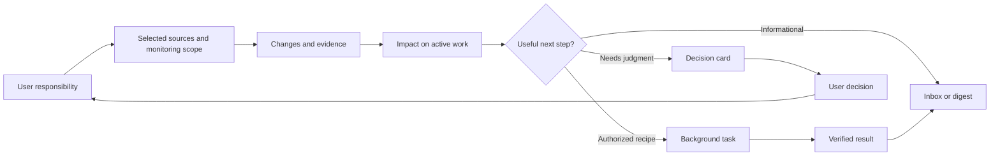

# Mysti Proactive Mode — Design Report

**Status:** Proposed product design; ready for engineering review, not implemented or deployed.  
**Date:** 2026-10-01  
**Companion:** [System design, contracts, and implementation plan](40-proactive-mode-system-design.md)  
**Format:** Markdown authorized by the user. Retains the Design Report template's section structure; the original Word reference is unchanged.

## Contents

- [Executive summary](#executive-summary)
- [Introduction](#introduction)
- [Key findings](#key-findings)
- [Implications](#implications)
- [Recommendations](#recommendations)
- [Conclusion](#conclusion)
- [Appendix](#appendix)

## Executive summary

Mysti Proactive Mode should act as an ongoing engineering partner: understand what the user is trying to accomplish, watch explicitly selected sources connected through DeepMyst, connect changes to active work, and either deliver a useful insight or complete a bounded piece of delegated work. Its value is fewer surprises, less duplicated effort, and more time for decisions that require the user.

**Recommended architecture:** DeepMyst owns durable monitoring, shared context, policy enforcement, scheduling, and notification delivery. Mysti owns the editor experience, local repository observations, and explicitly authorized local execution. Remote repositories and approved cloud jobs remain available when the editor is closed. Uncommitted local work remains unavailable while its device is offline unless the user explicitly shared a snapshot.

The central product object is a **responsibility**: an ongoing outcome with named sources, an owner, success criteria, action permissions, a budget, and notification rules. For example: “Keep the checkout release ready. Watch this repository, the release channel, the approved requirements document, and my release calendar. Warn me about conflicting changes. Run the agreed tests in isolation, but bring product tradeoffs to me.”

Start with a focused end-to-end release: GitHub and selected Slack channels through DeepMyst, local Git awareness, a prioritized insights inbox, desktop alerts, and one approved test recipe. Add email, calendars, requirement documents, mobile push, and more execution recipes through explicit release gates. Phone calls are a later opt-in escalation channel, not the default way to deliver ordinary updates.

### At a glance

| Decision | Recommendation |
| --- | --- |
| Product name | **Proactive** in Mysti; managed through the same DeepMyst account |
| Default behavior | Off until enabled; after setup, monitor selected sources and suggest actions |
| Automatic work | Only named, bounded recipes the user has enabled; no inherited blanket autonomy |
| Initial user value | Catch overlapping work, relevant upstream changes, and release blockers; finish a scoped test run |
| Notification strategy | Inbox as the durable record; interrupt only when delay matters; coordinate delivery across devices |
| Provider strategy | Provider-independent orchestration; use Claude, Codex, Mysti, or another certified executor when its capabilities meet the task contract |
| Key quality bar | Every actionable insight explains what changed, why it matters now, its evidence, and what the user can do |
| Primary constraint | Connection access, monitoring permission, execution permission, and permission to share are distinct |

## Introduction

### Problem and intended outcome

Important development context is distributed across a working tree, remote branches, pull requests, issue trackers, conversations, email, calendars, and evolving requirements. A user can spend hours implementing work that someone else has already started, finish against an obsolete requirement, or defer tests because a decision or meeting is more urgent.

Mysti should reduce that coordination burden without turning every source update into a notification. It should recognize when a change affects the current task, distinguish a verified conflict from a possible overlap, and offer a concrete next step. When permission and resources allow, it should do the bounded work and return evidence.

This is a design and architecture deliverable. No monitoring subscriptions, app connections, messages, schedules, or phone calls are activated by these documents.

### Users and jobs to be done

| User situation | Desired help | Observable outcome |
| --- | --- | --- |
| Developer starting an issue | Identify existing work and relevant decisions | Links to overlapping PRs or explicit work claims before a duplicate implementation |
| Developer mid-task | Detect upstream changes that affect their branch or assumptions | Impact summary with affected files, APIs, tests, and exact revisions |
| Lead approaching a deadline | Identify the decision or dependency that controls progress | A ranked next-action list with tradeoffs and owners |
| Developer short on testing time | Delegate a known test recipe | Reproducible run against an identified snapshot, with failures and limitations |
| Product/engineering review | Compare implementation with an approved requirements version | Coverage matrix; changed, unmet, ambiguous, and superseded requirements |
| User away from the editor | Learn about consequential developments and respond | A concise mobile update that opens the same insight and decision context |

### Scope assumptions

- DeepMyst remains the broker for external accounts and credentials. Mysti does not create a competing OAuth vault.
- Connected services expose different capabilities. “Connected” is never presented as proof that continuous monitoring is active.
- Start with personal responsibilities inside one organization/project boundary. Team responsibilities require explicit shared ownership and audience rules.
- Notifications to the user's verified destinations are configured separately from posting into shared channels or contacting other people.
- Numbers in this report are proposed pilot defaults and release criteria, not measurements of existing service performance.

## Key findings

### Context and conditions: what Dots establishes

The official documentation reviewed on 2026-10-01 describes these patterns. The Mysti column is our proposal, not a claim of equivalent implementation or access to Dots internals.

| Documented Dots pattern | Implication for Mysti |
| --- | --- |
| A cloud agent carries ongoing work across conversations and can work while the user's computer is off. [Overview](https://learn.chatgpt.com/docs/dots) | Keep responsibility state and remote work in DeepMyst; treat the editor as a client and optional worker. |
| Responsibilities can lead to background tasks, scheduled checks, or supported event-triggered work. [Tasks and memory](https://learn.chatgpt.com/docs/dots/tasks-and-memory) | Give each responsibility observable triggers, child tasks, and explicit completion criteria. |
| Proactive research is read-only; later actions have separate permissions. [Controls](https://learn.chatgpt.com/docs/dots/controls) | Separate observation, insight generation, and execution services with enforceable tool boundaries. |
| Context can inform work across contact methods without automatically mirroring messages or authorizing disclosure. [Channels](https://learn.chatgpt.com/docs/dots/channels) | Retain common task identity while evaluating what each destination may receive. |
| Saved notes support continuity; they are not a complete transcript of every conversation. [Tasks and memory](https://learn.chatgpt.com/docs/dots/tasks-and-memory) | Store versioned decisions, requirements, ownership claims, and supporting references, rather than indiscriminately accumulating chat history. |
| User-initiated voice calls are documented; calls initiated by the dot are described as planned after launch. [Channels](https://learn.chatgpt.com/docs/dots/channels) | Treat outbound Mysti phone escalation as a separate feature to design, implement, and validate. |

The most useful inspiration is responsibility over time, context that remains useful across surfaces, and timely requests for judgment. Mysti's differentiator should be precise engineering evidence: revision-aware impact analysis, explicit ownership signals, requirement lineage, and verified background work.

### Patterns in the existing code

This is a source review of the local working trees, not a production deployment audit. Detailed file references appear in [System Design §3](40-proactive-mode-system-design.md#3-background-and-problem-statement).

| Existing foundation | What it provides | Design consequence |
| --- | --- | --- |
| Mysti DeepMyst client and Connections UI | Account-scoped connection discovery and brokered MCP configuration | Extend discovery with monitoring capabilities and health; keep credentials in DeepMyst |
| ActiveModeManager and ChannelBridge | OpenClaw gateway status and channel routing | Keep optional compatibility; Proactive must not depend on installing OpenClaw |
| BackgroundJobManager | Persisted job summaries and interruption detection across editor hosts | Reuse its presentation patterns; move durable orchestration to the cloud |
| CollaboratorPool, permission handling, and sandbox code | Bounded provider delegation and execution controls | Build an executor adapter with an explicit contract; certify unattended behavior per provider/platform |
| Desk scope and identity modules | Explicit sharing boundaries and authenticated peer interaction | Preserve those boundaries; do not convert a read-only peer into a remote shell |
| DeepMyst workflow scheduling | Durable run creation and deduplication mechanisms | Reuse infrastructure after validating principal, lease, cancellation, and replay semantics |
| DeepMyst notification preferences | User channels, quiet hours, and read tracking | Extend for proactive incidents and device delivery |
| DeepMyst notification worker | Some checks log findings with a dispatch placeholder | Actual insight persistence and notification delivery are implementation requirements |

### Three product risks determine usefulness

**False certainty.** Similar files do not establish duplicate work, and a Slack suggestion does not necessarily change an approved requirement. State evidence and uncertainty directly: “Possible overlap” or “Requirement change proposed,” with links and a confirmation action.

**Interruption cost.** A correct fact can still be the wrong notification. Rank by relevance to the user's responsibility, consequence of delay, confidence, novelty, and whether the user can act. Respect focus time and suppress duplicate or resolved alerts.

**Invisible coverage gaps.** A missing event, disconnected source, or offline laptop can look like “nothing changed.” Show source freshness, monitored scope, and gaps. Never interpret missing visibility as proof that nobody else is working on the task.

## Implications

### Product model

A responsibility is an agreement about an outcome. A watch describes where changes can be observed. An insight describes an implication. A task does work. A notification delivers an insight or result. These objects have separate states: reading a notification does not approve a task; cancelling a task does not disconnect its sources.

### Core experience and screens

| Surface | Required behavior |
| --- | --- |
| Composer **Proactive** control | Shows Off, Monitoring, Working, Paused, or Needs attention, with a text label and icon as well as color |
| Setup | Select project, outcome, sources, ownership, recipes, budget, and destinations; preview scope before enabling |
| **Now** inbox | Prioritized decisions and relevant results; group updates to the same issue; keep source-health notices distinct |
| **Responsibilities** | Edit scope and success criteria; see next check, source freshness, budget, active tasks, and recent decisions |
| Insight detail | Show claim, impact, why now, evidence, confidence, freshness, and actions; expose a correction path |
| **Activity** | Inspect queued/running/waiting/failed/stale tasks, run environments, exact snapshots, artifacts, costs, and cancellations |
| **Context and decisions** | Inspect retained decisions, requirements, and ownership claims with sources and expiry; correct or forget derived notes without falsifying the source record |
| **Connections** | Show Connected separately from Monitoring, Delayed, Permission changed, Unsupported, or Reconnect required |
| **Delivery preferences** | Configure quiet hours, digest schedule, urgency threshold, destination verification, and phone opt-in |
| Mobile experience | Read the same insight, inspect evidence, snooze, decline, or open an authenticated decision; approval summaries remain legible |

Existing model/effort/Ultracode controls continue to govern foreground chat. Proactive recipes store their own approved execution configuration and display the actual provider/model used. A foreground provider switch cannot silently change a scheduled job's authority, cost ceiling, or model data policy.

### Onboarding flow

1. Choose a responsibility, such as **Avoid duplicated work**, **Keep this release ready**, or **Review against requirements**; allow a custom outcome.
2. Identify the repository and task/project. Normalize remote identity without credentials; for local-only repositories create an opaque repository identity.
3. Offer relevant DeepMyst connections. The user selects exact repositories, channels, email labels/folders, calendars, and documents. Newly connected apps are suggested for inclusion, not silently added.
4. Verify what each source can provide: events, polling, search on demand, or unsupported. Show any required setup and expected freshness.
5. Start in **Insights only**. Offer separately enabled recipes with an example run, environment, access, time limit, and budget. Existing chat permissions do not enable them.
6. Choose notification destinations and quiet hours. Send a test notification only when the user requests that test. Verify phone/device ownership before enabling those routes.
7. Show a reviewable summary, including local data shared and how to pause or stop everything. Enable creates a versioned responsibility and grants.

Empty state: “Choose what Mysti should keep track of.” Partial setup: “GitHub is monitored. Slack needs channel access.” Offline state: “Remote sources are current; local changes were last seen at 18:42.” No connections: local monitoring can still work while Mysti is running, with no claim of remote/team coverage.

### Five primary journeys

**1. Someone may already be doing this.** Before starting an issue, Mysti correlates an explicit assignment, a recent work claim, and open PRs. It finds a PR linked to the issue and touching the same API. The card says: “A related implementation is in progress,” names only visible evidence, and offers **Review PR**, **Compare scope**, and **Draft coordination message**. Posting that message requires the configured sharing/action authority. A semantic match alone gets a lower-confidence card and never blocks work.

**2. Another change may affect this branch.** A remote revision modifies an API used by the active task. Mysti identifies the pinned upstream and local revisions, explains the affected interface, and proposes an isolated compatibility check. It does not pull, rebase, or overwrite the user's working tree. If an approved recipe runs, the result records which revisions it tested. A new commit can make that result stale.

**3. Requirements have changed.** A new approved requirement version changes acceptance criteria. Mysti shows the previous requirement, the approved change, its source/approver, and which tests or implementation sections may no longer satisfy it. Discussion without approval produces **Proposed change—confirmation needed**, not an automatic rewrite of the baseline.

**4. There is not enough time to test.** The user enables a named recipe such as “Run checkout unit tests on my approved snapshot, at most 15 minutes, no network.” Mysti runs it in an isolated environment when capacity is available. It reports pass/fail/blocked, the command, revision, environment, skipped checks, and artifacts. “Process exited” and “all requirements validated” are different outcomes. If the environment cannot enforce the recipe, it waits or offers an approved cloud runner.

**5. Help me choose the next move.** Before a release decision, Mysti assembles relevant unresolved questions, dependencies, test evidence, and time constraints. It presents two or three options with consequences and a recommended next step. Calendar availability informs timing; it does not authorize rescheduling meetings or infer that a teammate is unproductive. Product priority changes remain suggestions unless a specific automation allows them.

### Example insight card

> **Decision needed · Checkout release**  
> **The approved retry limit changed from 3 to 1. Your branch still permits 3.**  
> Why now: the release review is in 40 minutes; the new criterion affects the retry tests.  
> Evidence: requirement v12, approved decision, code snapshot `c81e…`; checked 2 minutes ago.  
> Confidence: confirmed requirement change; implementation impact needs the proposed test.  
> **Run approved tests** · **Compare requirement** · **Snooze** · **Correct this finding**

This is a fictional example, not a finding about the user's repositories. Source links and snapshot identities are required in real cards. Preview text on a locked phone defaults to “Mysti has an update requiring your attention.”

### Attention and notification policy

| Class | Examples | Default treatment |
| --- | --- | --- |
| Digest | Routine progress, completed non-blocking review, low-confidence overlap | Durable inbox; batched at the user's chosen time |
| Timely | Relevant confirmed conflict, dependency unblocked, useful test result | Inbox; desktop when active, otherwise configured mobile route; honor quiet hours |
| Decision due | A specific user's decision is needed before a known deadline | Notification with deadline, options, and evidence; escalate only if configured and still unresolved |
| Critical | User-defined severe operational event supported by authoritative evidence | Configured urgent route; optional quiet-hours exception and phone escalation |

Pilot defaults: at most three unsolicited noncritical interruptions per working day; additional items stay in the inbox. Decision and critical rules have their own explicit caps and cooldowns. A model cannot label an item critical to bypass these limits. Reading on one device cancels pending routine duplicates; an unresolved decision may still escalate according to its rule. Provider acceptance of a push is not proof that the user saw it.

Phone means both **mobile app/push** and optional **SMS/PSTN voice**; the implementation must name these separately. SMS and calls require verified destinations, explicit enrollment, cost limits, and an unsubscribe/disable path. Calls announce Mysti and use a short, non-sensitive summary. No approval of code changes or privileged actions relies solely on a caller ID, SMS reply, or spoken “yes.” Those actions open an authenticated, version-bound decision.

### Autonomy and user control

| Mode/action | Intended authority |
| --- | --- |
| Insights only | Read selected sources, correlate changes, create private insights and configured notifications |
| Help with approved recipes | Above, plus exactly scoped tests, reviews, or draft artifacts within a granted budget |
| Draft a message, patch, or issue | Prepare privately; show destination and included context before publication |
| Publish a draft PR, shared comment, or issue update | Separate explicit action grant or approval; never implied by permission to prepare |
| Merge, deploy, destructive changes, permission changes | Excluded from initial proactive automation; hand back through the established interactive workflow |

**Pause monitoring** stops new observations and scheduled evaluations for the selected responsibility; existing jobs remain visible. **Stop task** cancels that task and descendants. **Stop all proactive work** disables new triggers, cancels active jobs, invalidates pending approvals, and suppresses pending nonessential notifications. Show any offline worker awaiting cancellation. **Disconnect source** revokes its use and invalidates dependent evidence and pending actions. None of these controls claim to undo already delivered messages or completed external effects.

## Recommendations

### Clarify the objective: build around decisions and evidence

Adopt six initial insight types with explicit evidence requirements:

| Type | Minimum evidence | Possible useful action |
| --- | --- | --- |
| Work overlap | Linked issue/PR or explicit fresh work claim; semantic similarity labeled separately | Compare scope; draft coordination note |
| Change impact | Revision delta plus an identified dependency/path/API relationship | Run compatibility recipe; inspect diff |
| Requirement drift | Versioned baseline and a new approved decision, or an explicitly tentative proposal | Compare criteria; produce gap report |
| Test gap | Change set, expected check set, and absent/stale/failed evidence | Run scoped tests; explain skipped checks |
| Decision bottleneck | Unresolved question, identified decision owner, and consequence/deadline | Present options; prepare a decision packet |
| Priority opportunity | Verified blocker/dependency or time constraint linked to a responsibility | Suggest next task and explain tradeoff |

Treat priority as a recommendation with visible reasons, not an unexplained numeric score. Use deterministic rules for scope, freshness, delivery eligibility, and authority; use models for interpretation and synthesis. Feedback such as **Already handled**, **Wrong link**, **Too noisy**, and **Not relevant** updates the relevant responsibility and evaluation data without expanding permissions.

### Sequence the work

| Phase | Deliverable | Gate before expanding |
| --- | --- | --- |
| P0 — Foundation | Responsibility and policy contracts; connector capability/health inventory; authenticated event pipeline; evaluator fixtures; authentication diagnosis | Scope isolation, revocation, replay, and budget tests pass; sign-in and connector authorization work in the target deployment |
| P1 — Useful local/remote loop | GitHub + selected Slack monitoring, local Git observations, overlap/change-impact insights, inbox and desktop alerts | Pilot usefulness/noise criteria met; offline states honest; no duplicate externally visible actions |
| P2 — Bounded offloading | One test recipe and one requirement-review recipe, durable jobs, result evidence, foreground resource priority | Jobs stop, recover, enforce budgets, and never mutate the working tree or expose secrets; unsupported providers fail closed |
| P3 — Wider context and mobile | Email/calendar/document adapters, requirement lineage, decision briefs, responsive mobile inbox and verified push | ACL changes invalidate evidence; quiet hours, device synchronization, and lost/expired push handling pass |
| P4 — Optional team and phone features | Shared responsibility ownership, narrowly granted publishing, SMS/call escalation | Audience isolation, organization policy, destination verification, telephony abuse/cost controls, and end-to-end delivery tested |

Each phase is a product increment with its own testable outcome. Do not advertise generic “monitor every connected tool”: show a capability matrix, add adapters incrementally, and expose on-demand-only connections honestly. No calendar-date estimate is offered before the connector and execution feasibility work in P0.

### Review the outcome

Proposed pilot: 10–20 consenting users for two working weeks, preceded by offline replay of annotated change scenarios. This is an evaluation plan, not a claim of recruited users.

| Metric | Proposed gate | Measurement |
| --- | --- | --- |
| High-priority precision | At least 85% of reviewed timely/decision cards judged relevant and correct | User labels plus independent review of an evidence-stratified sample |
| Coverage of known important events | At least 80% recall on the agreed scenario set | Annotated replay, including intentionally missed/noisy events |
| Interruption budget | At least 95% of user-days within configured limits | Delivery ledger; separately report user-authorized urgent exceptions |
| Evidence completeness | 100% of actionable cards include source/version/freshness and claim status | Schema validation and source-link audits |
| Useful offloading | Users accept results as useful in at least 70% of reviewed completed pilot recipes | User assessment; blocked and failed runs reported separately |
| Unauthorized action or disclosure | Zero in release tests; any production occurrence stops the affected path | Adversarial tests, audit review, incident response |
| Time returned to user | Report user-estimated time saved alongside actual runtime/cost | No fabricated “hours saved” counter |

Precision targets are provisional; low sample counts and confidence intervals must be reported. Engagement alone is not success. Evaluate whether users avoid rework, arrive prepared for decisions, and trust the system enough to keep it enabled.

## Conclusion

Build Proactive as an evidence-driven responsibility service in DeepMyst with a focused Mysti client. Deliver a small, credible monitoring-and-action loop first, then expand sources and destinations behind measurable gates. The launch promise is useful context and bounded help with traceable results; continuous coverage and execution depend on each connection's permissions, capabilities, and availability.

The recommended initial investment is P0–P2. Mobile delivery is a core follow-on capability. Phone escalation and broad shared-channel publishing should follow demonstrated signal quality and reliable authorization/delivery controls.

## Appendix

### Proposed design decisions

| ID | Decision | Rationale |
| --- | --- | --- |
| D1 | DeepMyst owns durable proactive state | Remote monitoring must survive editor/device shutdown |
| D2 | Add a distinct Proactive capability; keep OpenClaw Active Mode optional | Current integration and the proposed cross-app service have different lifecycles |
| D3 | Scope responsibilities explicitly | “Whatever is connected” should mean discoverable and selectable, not unrestricted ingestion |
| D4 | Separate insight generation from execution | Untrusted source text cannot grant authority to run tools |
| D5 | Approve bounded recipes, not every routine repetition | Useful offloading with predictable resources and effects |
| D6 | Use immutable evidence and correction paths | Changes and contradictions must revise insights without hiding history |
| D7 | Coordinate notifications through one incident identity | Avoid redundant desktop, phone, and channel interruptions |
| D8 | Require executor capability certification | A provider's presence or “read-only” label is insufficient for unattended tests |

### Questions with working defaults

| Question | Working default pending product review |
| --- | --- |
| First external sources? | GitHub and selected Slack channels; others through the same adapter contract |
| Initial ownership model? | Personal responsibility scoped to an organization/project; shared ownership later |
| Cloud data sharing for local work? | Off by default for file content; explicit snapshot consent for cloud execution |
| Mobile client? | Responsive DeepMyst inbox first; native push adapter when an authenticated mobile client exists |
| Phone escalation? | Disabled until explicitly enrolled; no ordinary progress calls |
| Model/provider choice? | Capability- and policy-based recipe selection; no hardcoded model/version assumption |
| Monetary entitlement? | Product decision required before paid unattended work; schema requires a finite account-approved budget |

### Sources and provenance

Official OpenAI documentation was reviewed for inspiration, not as an implementation dependency: [Dots overview](https://learn.chatgpt.com/docs/dots), [tasks and memory](https://learn.chatgpt.com/docs/dots/tasks-and-memory), [messaging](https://learn.chatgpt.com/docs/dots/channels), and [controls](https://learn.chatgpt.com/docs/dots/controls). Availability is evolving; this proposal does not assume that any Dots product feature or internal API is available to Mysti.

The source review includes Mysti and the adjacent DeepMyst 2.0 checkout. [System Design §3](40-proactive-mode-system-design.md#3-background-and-problem-statement) supplies implementation references and separates reusable code from missing functionality. User scenarios are illustrative and contain no inferred facts about real teammates, email, or calendar events.
