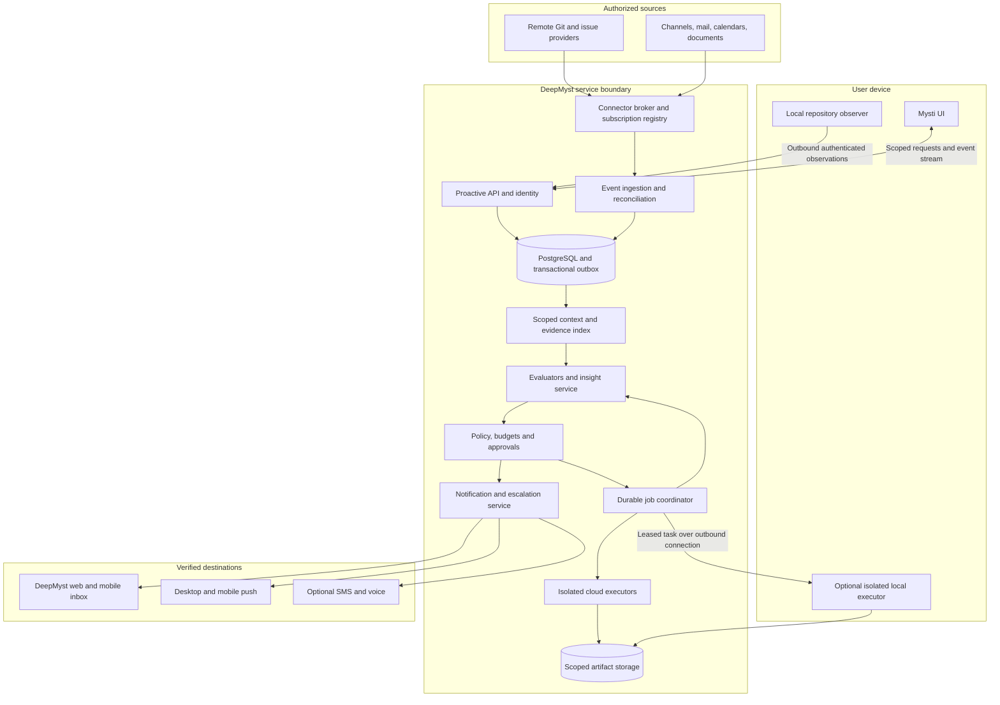
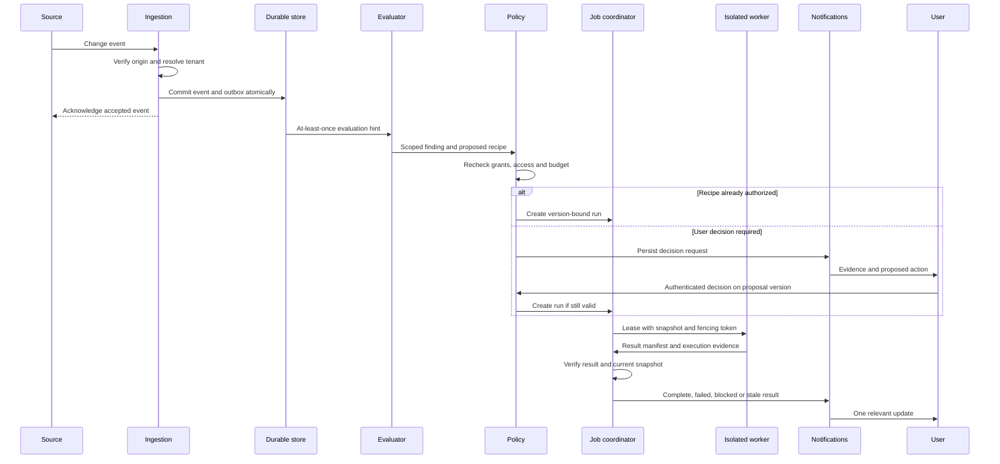

# Mysti Proactive Mode — System Design

**Proposal:** Durable engineering awareness and bounded delegated work through DeepMyst  
**Status:** Proposed; interfaces and targets below are design contracts, not deployed APIs  
**Date:** 2026-10-01  
**Product companion:** [Design Report](39-proactive-mode-design-report.md)  
**Format:** User-authorized Markdown adaptation of the System Design template. Its original reference file is unchanged.

## Contents

1. [Abstract](#1-abstract)
2. [Goals and Non-Goals](#2-goals-and-non-goals)
3. [Background and Problem Statement](#3-background-and-problem-statement)
4. [Proposed Architecture](#4-proposed-architecture)
5. [Request Lifecycle](#5-request-lifecycle)
6. [API and Data Contracts](#6-api-and-data-contracts)
7. [Consistency, Idempotency, and Replay](#7-consistency-idempotency-and-replay)
8. [Security and Privacy Considerations](#8-security-and-privacy-considerations)
9. [Operational Readiness](#9-operational-readiness)
10. [Alternatives Considered](#10-alternatives-considered)
11. [Open Questions](#11-open-questions)
12. [Decision and Next Steps](#12-decision-and-next-steps)

## 1. Abstract

Introduce a DeepMyst Proactive service that maintains user-defined responsibilities over authorized engineering and collaboration sources. Source adapters turn provider changes and local repository observations into durable events. A scoped context index connects tasks, code revisions, requirements, decisions, and ownership signals. Evaluators produce evidence-backed insights. A policy layer determines whether to notify, request a decision, or execute a previously authorized recipe. A delivery service routes updates to Mysti, desktop/mobile surfaces, and explicitly enrolled phone destinations.

The service is **event-driven with reconciliation**: webhooks reduce latency where available; cursor-based polling and reconciliation recover missed changes. MCP tool connectivity alone does not imply change subscriptions. Every adapter declares what it can observe and the authorization semantics it can enforce. Unsupported capabilities remain visibly unavailable.

DeepMyst stores authoritative responsibility, insight, job, approval, and delivery state. Mysti is an authenticated client and optional local worker. Local observations stop when the editor host stops unless a separately installed and explicitly enabled worker is later provided. Cloud monitoring and cloud execution continue independently. No new always-on local daemon is silently installed.

Core invariant: **source content can inform a finding but cannot authorize an action**. Authority is the intersection of organization policy, the user's versioned responsibility grant, source access, destination policy, and executor capabilities. Models produce proposals and explanations; deterministic services enforce these boundaries.

## 2. Goals and Non-Goals

### Functional requirements

| ID | Requirement | Acceptance evidence |
| --- | --- | --- |
| FR1 | Discover DeepMyst connections and their monitoring capabilities | Per-source scope, mode, freshness, health, and unsupported states |
| FR2 | Track local and remote Git state without changing the user's working tree | Revision/snapshot identities; no automatic checkout, pull, or rebase |
| FR3 | Correlate tasks, ownership signals, discussions, and dependencies | Evidence-backed overlap/impact cards with uncertainty and expiry |
| FR4 | Track approved requirement versions and proposed changes | Requirement lineage and implementation/test coverage reports |
| FR5 | Recommend priorities and decision options | Visible consequence/deadline/ownership reasoning |
| FR6 | Execute bounded, approved tests and reviews | Isolated run, scoped credentials, finite budget, cancellation, verified result |
| FR7 | Notify across desktop, mobile, and optional phone | Durable incident identity, audience checks, delivery history, quiet hours, deduplication |
| FR8 | Remain useful while the editor is closed | Durable remote-source processing; honest local-unavailable state |
| FR9 | Support Claude, Codex, Mysti, and other capable executors | Per-adapter certification; no implicit permission or model fallback |
| FR10 | Let users inspect, correct, pause, stop, and revoke | Auditable state transitions and prompt invalidation of dependent work |

### Nonfunctional requirements

- Tenant, principal, project, and audience isolation before retrieval and before delivery.
- At-least-once ingestion and execution dispatch, with deduplicated records and guarded effects; no end-to-end exactly-once claim.
- Bounded resource use for ingestion, retrieval, inference, execution, storage, and notification delivery.
- Version-bound decisions and reproducible test evidence.
- Accessible, consistent state across editor, web, and mobile clients.
- Explicit degraded states for offline devices, expired access, source lag, unavailable models, and ambiguous external effects.

### Non-goals for the initial release

Arbitrary desktop automation; hidden monitoring of all connected accounts; reading teammates' private working trees; employee productivity scoring; autonomous merging/deployment; automatic calendar rearrangement; unrestricted outbound messages; inferring emergency services from phone escalation; using an LLM's confidence as an authorization decision.

General-purpose autonomous task execution is outside this proposal. The execution surface is a set of finite, approved recipes. Local-only operation remains possible while the editor runs, but it cannot promise all-device-off monitoring or phone delivery without the cloud service.

## 3. Background and Problem Statement

### Existing implementation evidence

The following was inspected in local working trees on 2026-10-01. File presence and code paths do not establish production deployment, operational health, or completed release certification. DeepMyst links point to the adjacent checkout and require that checkout to exist locally.

| Area | Evidence | Reuse / gap |
| --- | --- | --- |
| DeepMyst connection client | [DeepMystClient.ts](../src/services/DeepMystClient.ts), [ConnectionsPanelManager.ts](../src/managers/ConnectionsPanelManager.ts), [DeepMystAuthManager.ts](../src/managers/DeepMystAuthManager.ts) | Reuse account integration; add health/capability/monitoring APIs. Previously observed sign-in failures require deployment-level verification before launch. |
| OpenClaw integration | [ActiveModeManager.ts](../src/managers/ActiveModeManager.ts), [ChannelBridge.ts](../src/managers/ChannelBridge.ts) | Existing channel features remain optional. They are not a durable DeepMyst event substrate. |
| Local background jobs | [BackgroundJobManager.ts](../src/managers/BackgroundJobManager.ts) | Persists summaries and marks lost hosts interrupted; it does not keep execution alive after host exit. |
| Delegation and permissions | [CollaboratorPool.ts](../src/services/CollaboratorPool.ts), [PermissionManager.ts](../src/managers/PermissionManager.ts) | Reuse gates/cancellation where appropriate; unattended task authority must be independent of an interactive panel. |
| Local sandbox | [MystiSandbox.ts](../src/services/MystiSandbox.ts) | macOS/Linux primitives exist; Windows and Linux without bwrap lack that primitive. Broad read access means this is not a complete hostile-repository execution boundary. |
| Team sharing | [DeskScope.ts](../src/services/desk/DeskScope.ts), [DeskContract.ts](../src/services/desk/DeskContract.ts), [DeskServingGate.ts](../src/managers/DeskServingGate.ts) | Reuse scope-validation principles. Keep Desk's read-only serving boundary; do not add remote command execution through it. |
| DeepMyst account connections | [me_mcp_connections_routes.py](../../DeepMyst%202.0/apps/core-api/src/domains/agents/me_mcp_connections_routes.py), [me_handler.py](../../DeepMyst%202.0/apps/core-api/src/domains/mcp/me_handler.py) | Account/principal-scoped broker exists. Current read-only auth rejects tool calls; a safe query-only proactive broker is a required addition, not a flag flip. |
| Workflow lifecycle | [workflow_service.py](../../DeepMyst%202.0/apps/core-api/src/domains/agents/workflow_service.py), [workflow_schedule.py](../../DeepMyst%202.0/apps/worker/src/tasks/workflow_schedule.py), [worker main.py](../../DeepMyst%202.0/apps/worker/src/main.py) | Reuse PostgreSQL/ARQ, transaction and run-dedup patterns. Existing periodic workflow policy is not sufficient for every event or deadline. |
| Notifications | [models.py](../../DeepMyst%202.0/apps/core-api/src/domains/notifications/models.py), [service.py](../../DeepMyst%202.0/apps/core-api/src/domains/notifications/service.py), [worker notifications.py](../../DeepMyst%202.0/apps/worker/src/tasks/notifications.py) | Preferences/read tracking exist. Worker checks include logging/dispatch placeholders. Add a real insight/delivery ledger and tenant-scoped dispatcher. |
| Webhook infrastructure | [dispatcher.py](../../DeepMyst%202.0/apps/core-api/src/domains/webhooks/dispatcher.py), [delivery.py](../../DeepMyst%202.0/apps/core-api/src/domains/webhooks/delivery.py) | Reuse reviewed signing/retry infrastructure where contracts match; outbound webhooks are not inbound monitoring subscriptions. |

No native mobile push or PSTN implementation was established by the inspected paths/searches. Those are proposed adapters with separate rollout gates. Current infrastructure must not be described as already providing this feature.

### Architectural consequences

Keep Proactive separate from the existing OpenClaw Active Mode setting. Add a bounded `ProactiveClient` integration rather than placing the scheduler and every adapter inside `ChatViewProvider`. Adapt the existing job presentation to remote state while leaving existing chat jobs intact. Keep authoritative state out of webview memory and VS Code globalState.

Existing MCP routes may forward broad provider tools. A proactive research service must receive an enforced read/query-only tool registry with parameter-scoped access and no mutation delegation. Treat unclassified or newly changed tool schemas as unavailable until reviewed. Provider annotations are evidence for classification, not enforcement.

## 4. Proposed Architecture

### Figure 1 — components and trust boundaries



PostgreSQL is the source of truth. ARQ/Redis carries disposable work hints, concurrency coordination, and caches; queue loss cannot erase accepted events, approvals, or job intent. Object storage holds immutable snapshots and run artifacts with scoped access. Begin with relational tables plus indexed relation edges; add a specialized graph/vector service only if measurements justify it. Vector search is optional candidate retrieval and cannot bypass ACL filtering.

### Core components

| Component | Responsibility and boundary |
| --- | --- |
| Responsibility service | Own outcome, owner, project, source scope, baseline, recipe grants, budgets, delivery rules, and policy version |
| Connection capability registry | Advertise observation modes, resource selectors, tool risk, ACL/deletion signals, rate limits, health, and adapter version |
| Source adapters | Read or subscribe under an authorized principal; renew subscriptions, reconcile cursors, map deletions/revocations |
| Ingestion service | Validate provenance/signatures, resolve tenant server-side, deduplicate, durably persist event + outbox before acknowledgement |
| Local observer | Track selected repositories and active task association; send minimized observations with device sequence numbers |
| Context/evidence service | Maintain permission-scoped source versions and relations, requirement lineage, explicit work claims, and source freshness |
| Evaluators | Deterministic candidate selection, bounded retrieval, model interpretation, evidence validation, and insight revision |
| Policy engine | Decide observe/propose/execute/deliver using grants and current access; denies unknown effects |
| Job coordinator | Create run contracts, reserve budget, lease workers, enforce deadlines, accept fenced results, reconcile retries |
| Executors | Perform a certified recipe in an isolated environment with exact inputs and a verifiable output contract |
| Notification service | Deduplicate incident delivery, apply urgency/quiet-hours/audience rules, track attempts and acknowledgements |
| Audit and feedback | Record decisions and effects without duplicating unrestricted source content; collect correctness/usefulness feedback |

### Connector capability contract

“Whatever tools are connected” means discovery and selective use through a common adapter, not blanket support. Each connection reports:

- `observationModes`: `webhook`, `delta_poll`, `snapshot_poll`, `on_demand`, or none.
- `resourceKinds` and supported selectors: repositories, branches, channels, folders/labels, calendars, documents, projects.
- Verified principal, organization, source ACL semantics, sharing constraints, and token/subscription expiry.
- Supported event kinds, revision identities, deletion/tombstone behavior, pagination and cursor semantics.
- Read/query tool allowlist, parameter constraints, adapter/schema version, and supported execution actions separately.
- Health: `ready`, `syncing`, `delayed`, `reauth_required`, `permission_changed`, `unsupported`, or `disabled`; last success, coverage watermark, and error category.

| Source family | Proposed observation | Explicit limitation |
| --- | --- | --- |
| Local Git | Worktree/index/HEAD observation plus debounced reconciliation in Mysti; active issue association | No teammate uncommitted state; no observations while the device/observer is offline |
| Remote Git/PR/CI | Verified provider events where available, plus incremental reconciliation | No guarantee that every Git host exposes identical events or permissions |
| Slack/Teams | Selected conversations via supported subscription or incremental query adapters | Channel membership is not a monitoring grant; private threads retain their audience constraints |
| Email | Selected folders/labels and supported change cursors or polling | “All mail” requires explicit scope; attachments need separate content policy |
| Calendar | Selected calendars, event deltas, timezone-aware scheduling | Default read-only; no attendee invitations or rescheduling |
| Requirements/issues/docs | Versioned fetches plus approval-state mapping | Discussion text does not create authoritative requirements by itself |
| Generic MCP | Bounded query polling only for vetted tools and known resource/version contracts | If events or safe queries cannot be established, show on-demand-only or unsupported |

The UI must show **Connected**, **Monitoring enabled**, and **Current coverage** independently. Verify actual source capabilities during P0; do not hardcode provider rate limits or subscription lifetimes from this proposal.

### When evaluation runs

Use four trigger classes: a relevant source change; a user/context change such as starting a task, selecting an issue, or changing the responsibility's priority; a scheduled checkpoint/deadline; and a completed or failed background task. Context-triggered evaluation is necessary even when no new external event occurred: an existing PR becomes relevant when the user starts related work.

At task start, Mysti sends a scoped intent containing the selected responsibility, repository, issue ID if known, and an explicitly shareable task summary. Run a bounded preflight against the existing context index. Show useful results asynchronously; do not block ordinary chat indefinitely on unavailable connectors. A responsibility can explicitly require a particular preflight before its automated recipe executes. Do not stream every keystroke, editor file, or foreground conversation into DeepMyst.

Scheduled evaluations carry an IANA timezone, next due time, expiry/end condition, and catch-up rule. Treat an inferred deadline without a timezone or authoritative source as uncertain. Opportunities to perform optional work use worker availability and the user's schedule only within granted recipes and budgets; user inactivity by itself grants no authority.

### Local repository observation and execution separation

Normalize remotes without embedded credentials. Remote repositories use provider-issued identities when available; local-only repositories use a user/device-bound opaque ID. Treat forks as related but distinct repositories. Worktrees, submodules, and multi-root workspaces retain separate identities. Explicitly associate a responsibility with an issue/task rather than inferring every open editor file as assigned work.

Observe HEAD/index/worktree changes through read-only Git operations and filesystem signals, with periodic reconciliation and a persisted observation sequence. Disable hooks/external diff/filter execution in observation commands and validate path boundaries and symlinks. Metadata sharing includes only user-selected fields; paths and branch names can be sensitive too. File content, diffs, untracked files, binaries, and secrets are not uploaded merely because monitoring is enabled.

For cloud analysis of uncommitted work, the user approves an immutable snapshot manifest. For local analysis, bind the result to a manifest digest of approved inputs. Do not stash, rebase, change branches, or run tests in the user's live working tree. Untracked files are excluded unless individually included. A Git worktree alone is not a security sandbox.

### Context and insight inference

The relational context model links `Repository`, `Revision`, `Task`, `PullRequest`, `RequirementVersion`, `Decision`, `Person`, `WorkClaim`, `CalendarConstraint`, `Run`, and `Artifact`. Edges are typed assertions such as `implements`, `depends_on`, `changes`, `assigned_to`, `proposed_by`, or `supersedes`. Every assertion carries provenance, scope, confidence category, observation time, and expiry/revalidation rules.

Identity resolution starts with provider identity IDs and explicit account mappings. Names alone never merge two people. Explicit issue assignment and self-declared work claims outrank semantic similarity. Claims expire or are marked uncertain when their sources are stale. Private team activity may inform a private insight only within the principal's access; it cannot leak through shared summaries.

Evaluation pipeline:

1. Filter by responsibility scope, policy version, source health, and affected entity IDs.
2. Coalesce event bursts; ignore known irrelevant/generated changes according to the responsibility's rules.
3. Retrieve a bounded evidence set under current source permissions. Preserve source version and timestamp.
4. Use deterministic detectors for direct revision/assignment/requirement changes; use a model only where interpretation adds value.
5. Produce structured claims: `confirmed`, `inferred`, or `needs_confirmation`, each with evidence references and limits.
6. Validate references, source access, snapshot currency, and allowed action templates. Reject invented evidence or unsupported tool actions.
7. Cluster by responsibility + entity + finding type + baseline; create/update/resolve one insight.
8. Calculate relevance, urgency, confidence, novelty, and user-actionability; apply policy and attention budget before delivery or execution.

Calibrate confidence using labeled outcomes, not a model's raw probability. A new source can raise uncertainty rather than force a conclusion. Contradictory requirements remain visible until an authorized owner resolves them. Source removal invalidates derived assertions and may require recomputation from remaining authorized evidence.

## 5. Request Lifecycle

### Figure 2 — an upstream change becomes useful help



### State transitions

| Object | States and important transitions |
| --- | --- |
| Responsibility | `draft → active ↔ paused → archived`; source/job health is shown separately |
| Subscription | `pending → active → degraded / reauth_required / revoked`; failed renewals never silently become healthy |
| Insight | `candidate → validated → open → resolved / dismissed / superseded / invalidated`; notification attempts do not change truth status |
| Approval | `pending → approved / denied / expired / superseded / revoked`; approval is single-use for the exact proposal version |
| Job | `proposed → awaiting_approval → queued → leased → running → verifying → succeeded / failed / blocked / stale / cancelled / outcome_unknown`; a granted recipe may skip awaiting approval |
| Cancellation | `requested → acknowledged`; until acknowledged or lease expiry, report cancellation pending |
| Delivery | `scheduled → attempting → provider_accepted / failed / outcome_unknown / suppressed / expired`; delivered/read/decision-acknowledged receipts are separate fields |

A worker process finishing is not a successful outcome. A `test_result` verifier checks snapshot, recipe, command digest, exit code, timeout, expected reports, failed/skipped test counts, and artifacts. A `requirements_review` verifier checks the requirement baseline and coverage references; an LLM review does not become a test pass. Freshness is checked again before results are shown as current.

### Background job dispatch

The coordinator chooses a certified executor based on recipe capability, OS/container isolation, provider/tool permissions, data policy, dependencies, foreground load, and budget. It may select Claude, Codex, or Mysti, but cannot silently change to a provider with broader access or different approved data handling. CLI availability alone does not qualify an executor.

Each job has immutable inputs, an absolute deadline, bounded attempts, a resource envelope, allowed tools/network destinations, credential requirements, and expected output schemas. Local foreground work has priority. Default local proactive concurrency is one, with pausing/refusing new work under resource pressure. Cloud concurrency is bounded per tenant and principal.

Repository tests are executable code. Unattended tests require a dedicated container/VM or equivalently certified environment with no ambient personal credentials, minimal mounts, resource limits, and default-denied egress. The existing local sandbox and an isolated worktree are useful components but are not sufficient proof of this boundary. On unsupported Windows/Linux setups, offer a certified cloud executor or an interactive handoff; never fall back to unrestricted host execution.

Dependency installation is a separate declared setup step with pinned inputs and separately approved egress. Avoid live production integrations, package postinstall surprises, Docker socket mounts, and inherited SSH/cloud credentials. A job that needs unavailable access becomes blocked with an actionable explanation.

### Cancellation and source invalidation

`Stop all` increments a principal/responsibility cancellation epoch, prevents new leases, revokes pending approvals, publishes cancellation signals, and suppresses nonessential pending deliveries. Workers check epoch and policy before each tool call or recipe step and heartbeat while running. A lost connection cannot extend a lease: the worker must stop by its local lease deadline. Killing a process tree is required; cancelling an HTTP request alone is insufficient.

Revocation events invalidate source versions, dependent insights, snapshots, and proposed actions immediately in the application's access layer. Before any publication or further source fetch, authorization is rechecked. Work already executing may take until the next safe checkpoint or forced termination; the UI reports that latency honestly. Results arriving under an old lease or grant are quarantined and cannot publish.

## 6. API and Data Contracts

All paths in this section are **proposed additions**. Publish OpenAPI/JSON Schema contracts in a versioned shared package during P0 and generate TypeScript/Python types from that source. The following examples are illustrative and contain fictional IDs.

### Primary data contract

```json
{
  "schema_version": "mysti.proactive/1",
  "id": "resp_checkout",
  "version": 4,
  "owner_principal_id": "user_example",
  "project_id": "project_checkout",
  "outcome": "Keep the checkout release ready",
  "state": "active",
  "source_bindings": [
    {"connection_id": "conn_git", "resource_ids": ["repo_42"], "monitoring": "events_and_reconcile"},
    {"connection_id": "conn_chat", "resource_ids": ["channel_release"], "monitoring": "delta_poll"}
  ],
  "requirement_baseline_id": "requirements_v12",
  "recipe_grants": [
    {"recipe_id": "checkout_unit_tests", "recipe_version": 2, "executor_class": "isolated", "max_runtime_seconds": 900, "network": "deny"}
  ],
  "budget": {"currency": "USD", "daily_limit": "2.00", "max_run_cost": "0.50", "max_concurrent_runs": 1},
  "delivery_policy_id": "delivery_personal_v3",
  "grant_version": 7,
  "retention_policy_id": "proactive_default_v1"
}
```

These costs are illustrative finite caps, not product pricing or a proposed entitlement. Tenant identity, authenticated principal, approved grants, and effective policy are derived/verified server-side; request bodies cannot nominate a more privileged owner. Money uses fixed-point arithmetic, not binary floats.

### Persisted entities and constraints

Every entity includes organization/principal scope as appropriate. Unique keys below are within that scope; no global deduplication may expose another tenant's data.

| Entity | Required fields and constraints |
| --- | --- |
| Responsibility | Owner, project, version, outcome, state, source scope, baseline, grants, budget, cancellation epoch |
| SourceBinding | Connection/resource IDs, permitted selectors, adapter version, cursor, subscription expiry, freshness watermark, authorization version |
| SourceEvent | Source event ID or deterministic adapter key, source revision, kind, occurred/received time, principal, ACL reference, payload pointer, trace ID; unique `(binding, dedup_key)` |
| EvidenceVersion | Stable source locator, immutable revision/digest, observed/access-check times, ACL/consent lineage, content classification, retention expiry |
| Assertion | Typed relation, supporting evidence IDs, claim status, effective interval, revalidation/expiry; no unsupported assertion without provenance |
| Insight | Responsibility, incident key, version, claim/impact/why-now, evidence IDs, priority class, status, proposed action, freshness watermark |
| Recipe | Versioned command/tool templates, inputs, environment digest, allowed mounts/egress, resource limits, result schema/verifier |
| Approval | Principal, proposal hash, insight/recipe/snapshot versions, destination/args digest, grant version, expiry, decision, consumed run ID |
| JobRun | Immutable contract hash, idempotency key, state, lease holder/epoch/expiry, attempts, deadline, policy/cancel version, budget reservation |
| RunResult | Snapshot and environment digests, provider/model, command/tool log references, exit/status, verifier result, artifacts, cost and limitations |
| WorkClaim | Task/repo scope, visible principal, source, observed time, expiry, explicit/inferred status; no indefinite inferred ownership |
| DeliveryIntent | Insight/decision version, recipient, audience scope, destination, policy, escalation step, scheduled time, TTL, dedup key |
| DeliveryAttempt | Provider request ID, timestamps, error/retry class, accepted/delivered/read timestamps and any uncertain outcome |
| AuditEvent | Actor, action, scope, policy decision, object versions, trace ID; content minimization and append-only integrity controls |

Indexes prioritize binding cursor/revision, affected entity, responsibility state, ready jobs, due deliveries, and expiry. Retention/invalidation indexes must exist before launch. Store large content and artifacts separately; logs and notification payloads carry identifiers and redacted summaries rather than full mailbox or repository content.

### Proposed API surface

| Method and path under `/api/v1/proactive` | Contract |
| --- | --- |
| `GET /capabilities` | Account-entitled feature flags, connector/executor/delivery capabilities and health |
| `POST /responsibilities` | Validate scope and create draft/active responsibility from an explicit user action |
| `GET /responsibilities` | Authorized responsibilities with coverage, budget, and active-job summary |
| `PATCH /responsibilities/{id}` | Optimistic concurrency through `If-Match`; widening authority requires a new grant |
| `POST /responsibilities/{id}/pause` | Stop future observations/evaluations for that responsibility; return active jobs |
| `POST /responsibilities/{id}/stop` | Increment cancellation epoch, revoke proposals, cancel jobs, suppress pending deliveries |
| `POST /stop-all` | Apply stop semantics across the authenticated user's proactive responsibilities |
| `GET /insights?cursor=...` | Scoped, paginated, versioned inbox; stable cursor and freshness metadata |
| `POST /insights/{id}/feedback` | Structured correction/dismissal with expected version and optional explanation |
| `POST /approvals/{id}/decision` | Authenticated approve/deny against proposal hash/version; stale decisions return conflict |
| `GET /runs/{id}` | Run state, contract, progress, artifacts, and uncertainty; resource authorization required |
| `POST /runs/{id}/cancel` | Idempotent cancellation request; distinguish requested from acknowledged |
| `POST /devices/enroll` | Interactive device enrollment and proof of possession; no long-lived broad app key |
| `POST /observations:batch` | Device-signed, bounded local observations with sequence and content-consent references |
| `GET /events` | Authorized SSE stream with monotonic event IDs and resumable cursor; polling fallback |
| `POST /destinations/verify` | Challenge flow for the authenticated user's own device/contact method; rate limited |
| `PUT /delivery-policy` | Versioned preferences, quiet hours/timezone, verified destinations, urgency and cost limits |
| `POST /delivery-tests` | Send an explicitly requested, rate-limited test to an already verified destination |

Worker protocol operations are `claim`, `heartbeat`, `progress`, `result`, and `cancel_ack`. Each carries a worker identity, run ID, lease epoch, contract hash, and monotonically increasing per-attempt sequence. `claim` returns the immutable input manifest, relative lease duration, absolute run deadline, current cancellation/grant versions, and only the capabilities needed for that run. Heartbeats cannot expand scope or budget. Duplicate progress is ignored; duplicate identical results return the recorded outcome; a changed result under the same identity is rejected. Artifact uploads are bound to that run and quota, finalized with content digests, and remain private until verification.

Worker lease/heartbeat/result and provider webhook endpoints are separate service/device routes, not exposed as arbitrary chat tools. Source webhook routing resolves the binding from a server-held subscription ID, validates signatures/timestamps, and never trusts a payload-provided tenant ID. All state-changing API operations require idempotency keys and appropriate authentication/CSRF defenses for their client type.

Typed errors include `scope_denied`, `source_stale`, `connection_reauth_required`, `unsupported_capability`, `executor_unavailable`, `budget_exhausted`, `policy_changed`, `stale_proposal`, `snapshot_changed`, `lease_expired`, and `outcome_unknown`. A 403 explains the failing access boundary and offers reconnect/admin help where appropriate; it must not trigger a retry storm or bypass permissions.

### Contract guarantees

- API authorization occurs before existence/content disclosure; cursor and object IDs do not confer access.
- Approval is bound to the exact action, arguments, recipient, snapshot, recipe version, and current policy, with a single-use consume operation.
- SSE is a delivery optimization. Clients reconcile durable state after missed/expired cursors; no invariant depends on an uninterrupted stream.
- Idempotency keys bind to principal, endpoint, and canonical request hash. Reuse with different content returns conflict.
- Device enrollment grants only declared observation/execution scopes; third-party OAuth credentials never travel to the local agent.
- Unsupported schema major versions fail closed; optional additive fields are ignored safely. Stored contracts retain the version used for verification.

## 7. Consistency, Idempotency, and Replay

### Ingestion and reconciliation

A source may duplicate, reorder, omit, or redact events. Persist the normalized event and its evaluation outbox entry in one transaction before acknowledging a verified callback. Polling advances its cursor only after the page and outbox commit. Fetch current object state when an event is only a hint or lacks a total revision order. Source event time is evidence, not a trustworthy global clock.

Maintain per-binding watermarks and explicit coverage windows. Webhooks are complemented by scheduled reconciliation. Expired delta cursors trigger a bounded rebaseline; label the gap and avoid replaying a flood of stale notifications. Deletions create tombstones and invalidate dependent records. Connection loss pauses that source's evaluations while other authorized sources remain usable.

Queues retry with exponential backoff, jitter, bounded attempts, and provider rate-limit handling. Permanent permission errors stop and surface remediation. Poison events go to a scoped dead-letter queue with an operator replay path. Replay regenerates/upgrades the same incident identity and cannot blindly resend a notification or repeat an external effect.

### Leases, fencing, and effects

Run creation, finite budget reservation, and dispatch outbox insertion are atomic. Workers lease jobs with a monotonically increasing epoch. Heartbeats and results must carry the current epoch and run contract hash. A stale worker's result cannot finalize the job or publish an artifact to the user as current.

The effect gateway checks run/lease/policy/cancellation state before each allowed external mutation. Apply a unique effect key when the external provider supports it. When a provider does not support idempotency and an operation times out after possibly succeeding, mark `outcome_unknown`, reconcile with provider state, and ask for a decision if still ambiguous. Do not retry sending a message or creating an externally visible artifact merely because the HTTP response was lost.

A stale lease must not cause concurrent reruns against shared mutable state. Recipes use immutable snapshots and private environments. If an existing attempt cannot be proven stopped, a fresh worker may prepare independent read-only work but cannot execute a conflicting effect. Local workers stop at lease expiry even without cloud connectivity.

Existing DeepMyst workflow scheduling provides useful transaction/dedup patterns, but its skipped-at-cap and catch-up behavior must be reviewed per responsibility. A daily digest can coalesce missed schedules; a due decision requires explicit overdue handling. Do not equate a unique run row with exactly-once external effects.

### Freshness and changes during work

At dispatch, record the exact source/requirement/snapshot versions. Before notification or action publication, recheck current scope and relevant versions. A completed run remains a valid historical result for its snapshot but becomes **stale for the current branch** if required inputs changed. Re-running requires another budget reservation and a still-valid grant. Coalesce repeated changes and cap retries to prevent a busy branch from triggering endless work.

### Notification consistency

Use `(incident_id, recipient, policy_version, escalation_step)` as the logical delivery key. Keep each provider attempt separately. Re-evaluate resolution, audience, quiet hours, and TTL just before dispatch, not only when the intent is created. A resolved incident suppresses pending escalation. A new material revision may update an existing notification or create a new permitted delivery; cosmetic wording changes do not.

A read receipt suppresses routine duplicates. A decision acknowledgement closes that decision's escalation, not necessarily the underlying task. Receipt time comes from validated client/provider events. Do not treat “provider accepted” as “delivered,” “read,” or “approved.”

## 8. Security and Privacy Considerations

### Authority and information flow

Effective authority is the intersection of organization policy, user grant, connection/resource access, destination audience, and executor capability. Tenant ID is resolved from authenticated state; source records, caches, indexes, vectors, jobs, artifacts, and notifications remain scope-partitioned. Service accounts have narrow capabilities and cannot impersonate a user by supplying a user ID in a prompt.

Check ACLs before retrieval, at job dispatch, and before result delivery/publication. Derived summaries inherit the most restrictive relevant source audience; sharing to a larger audience requires recomputation from independently shareable evidence, not simply removing citations. Revalidate source permissions and artifact download authorization on access. Revocation blocks reads immediately even if asynchronous physical deletion is still in progress.

The initial research service has no publishing credentials, mutation tools, shell, or computer-control tools. Use a reviewed query broker rather than giving it the existing general-purpose MCP tool surface. Adapter allowlists constrain both tool name and parameters/resources. Unknown, changed, or ambiguously side-effecting tools require review. A read-only bearer that currently blocks all tool calls is not a working proactive read adapter.

Emails, commits, document text, tool results, and channel messages are untrusted data. They cannot change rules, authorize new destinations, request secret extraction, or choose shell commands. Keep source content separate from trusted instructions; validate structured model output against known action templates; use the policy/effect gateways regardless of model output. Reuse existing egress screening as a second boundary, not as a substitute for access control before retrieval.

### Execution and approvals

Use short-lived, least-privilege credentials per run. Cloud workers get minimal source snapshots and explicit network destinations, not a full user's connection vault. Local executor credentials remain outside the job environment. Secret scanning and path exclusions are defense in depth, not a guarantee that arbitrary local files are safe to upload.

Approval views show action, recipient, scope, snapshot, estimated maximum cost, and expiry. Bind a decision to a canonical proposal hash. Changes to destination, arguments, inputs, grant, or recipe invalidate that approval. Shared team responsibilities require a designated owner/approver; private members' access cannot be unioned into a privileged shared agent.

Push/SMS payloads are minimal and redact sensitive source details by default. Deep links carry opaque identifiers, not bearer tokens; opening them requires authenticated authorization. A delivery receipt, email address, phone number, or voice response is not sufficient authority for privileged execution. Destination enrollment/change requires authenticated proof and is rate limited to prevent notification/call abuse.

### Proposed retention defaults

| Data | Pilot default | Exceptions and deletion behavior |
| --- | --- | --- |
| Raw source content cache | Up to 7 days; fetch smaller excerpts where possible | Source/admin policy may shorten or prohibit storage |
| Normalized metadata and evidence references | Up to 30 days | Retain only what is needed for active responsibilities; expired evidence cannot support new actions |
| Active requirement/decision baselines | While responsibility is active, reviewed every 30 days | Reference permissions continuously checked; source removal invalidates content |
| Insight and result artifacts | 30 days after resolution | User may explicitly retain eligible artifacts; policy remains binding |
| Temporary code snapshots/run environments | Delete within 24 hours of terminal cleanup | Retained result artifacts are separately scoped; failed cleanup raises an operational alert |
| Minimal security/action audit | 90 days | Organization retention configuration; no full source bodies or secrets |
| Voice call recordings | Off | Any future recording needs separate notice, consent, policy, and retention |

These are proposed defaults subject to product/security review. “Delete responsibility” stops work and starts deletion of owned content, indexes, summaries, and artifacts; audit records are minimized according to disclosed policy. Backups have a documented expiry and restore-time tombstone replay. Disconnection immediately removes access and schedules dependent-content purge; do not promise immediate physical deletion from all backups. Implement and verify the purge path before enabling broad source ingestion.

## 9. Operational Readiness

### Notification delivery and device behavior

| Destination | Proposed transport and product behavior | Reliability boundary |
| --- | --- | --- |
| Mysti inbox | Authenticated SSE plus cursor-based reconciliation | Durable cloud state survives panel closure/reload |
| Desktop | In-editor notification initially; optional native OS adapter with declared host support | VS Code notifications are not automatically equivalent to OS notifications while the editor is closed |
| Web/mobile inbox | Authenticated responsive DeepMyst UI with shared read/decision state | Available without a native app; no claim of background push until supported |
| Mobile push | APNs/FCM or supported Web Push adapter selected for the actual client | Requires client/device registration and OS permission; provider acceptance is not user receipt |
| Email or private messaging | Existing DeepMyst connection plus explicit destination grant | Recipient/audience and content checked on each delivery |
| SMS | Verified opt-in number and telephony adapter | Costs, reachability, throttling, unsubscribe, and uncertain delivery tracked |
| Phone call | Opt-in critical escalation through a telephony adapter | Short identified call; no sensitive voicemail; no reliance on spoken approval for privileged actions |

Default routing favors the active client when presence is fresh; stale presence falls back to the user's chosen route. Presence is coarse and short-lived, not behavioral surveillance. Quiet hours use an IANA timezone and handle overnight windows and daylight-saving transitions. A critical exception must be a user/admin rule, with escalation attempts capped; lack of acknowledgement never enables unlimited calls. For a configured phone escalation, propose at most one call per incident per hour, with a finite daily cap chosen at enrollment.

Treat push, SMS, and telephony as optional adapters. A missing adapter appears unavailable in setup. Delivery failure keeps the insight visible and can use a configured fallback after the policy-defined delay. If every route fails, expose that state in the inbox/connection health; never mark it delivered.

### Planning envelope and proposed targets

Initial sizing assumption for design review: 100 pilot users, 5 active responsibilities each, 10 selected resources per user, and 100 relevant normalized events per user per day: approximately 10,000 events/day before burst handling. Design load tests for a 100× one-hour burst and large-resource pagination. These are hypothetical workloads; measure actual connector fanout, payload sizes, and token use before production sizing.

| Measure | Pilot target / definition |
| --- | --- |
| Accepted event durability | Every acknowledged valid event recoverable from the database/outbox; verify crash boundaries |
| Event-to-insight latency | p95 below 2 minutes after DeepMyst receives an eligible event, excluding source lag; polling freshness disclosed separately |
| Source polling | Adapter-specific negotiated interval; initial planning target 5–15 minutes where quotas permit |
| Local observation delay | Debounce 2–5 seconds after a stable change; periodic reconciliation within 5 minutes while active |
| Job cancellation | Online worker begins termination within 5 seconds of receiving cancellation; hard lease expiry no later than 60 seconds without renewal |
| Worker lease | Proposed 60-second lease, heartbeat every 15 seconds; tune from actual process termination behavior |
| Critical delivery enqueue | p95 under 30 seconds after an eligible confirmed insight; external delivery measured separately |
| API service availability | Initial 99.5% monthly target for core reads/writes; upstream outages reported separately |
| Recovery | Daily restore exercise in staging; initial RPO 15 minutes/RTO 4 hours as deployment targets, not existing guarantees |

The event durability target applies within the running database's guarantees; disaster recovery still follows the declared backup RPO until stronger replication is deployed. Report source lag, evaluator lag, worker queue time, provider delivery latency, and user acknowledgement separately.

### Cost and resource controls

Budget accounts reserve worst-case run/inference/delivery cost before dispatch, consume actual usage, and release unused reservations. Include model tokens, tool calls, compute, storage, and paid notification attempts. Limit evaluation frequency per responsibility and coalesce bursts. Use deterministic filters before inference, bounded retrieval/token budgets, result caching by scope+input+model/policy version, and inexpensive models only when they meet the validated task/data contract.

Never borrow foreground budgets, silently switch to paid providers, or retry indefinitely. When a cap is reached, stop new chargeable work and emit one budget notice through an already permitted route. If a provider cannot supply enforceable token/time limits or cost bounds, it is ineligible for an automatic paid recipe. Estimated and billed costs remain separately labeled.

### Observability and runbooks

Propagate a trace ID from source event to evidence, insight, policy decision, run, artifact, and delivery. Metrics are tenant-scoped and aggregated without content: cursor age, expired subscriptions, outbox lag, duplicate rate, insight revision count, rejection reasons, approval latency, lease expiry, cancellation latency, execution failure, budget consumption, notification suppression, receipt gaps, and feedback quality.

Required runbooks: source 401/403 and revoked scopes; expired cursor/rebaseline; missed webhook; queue/database outage; stale/rogue worker; ambiguous external effect; notification storm; cross-tenant disclosure; lost mobile device; signing-key rotation; budget misaccounting; poisoned source content; deletion backlog. Provide kill switches at global, tenant, connector, responsibility, recipe, executor, and destination levels. A kill switch is checked by the effect gateway, not just the UI.

Deploy migrations additively, shadow-evaluate before enabling delivery, and keep new features off by default. Canary per tenant, then per responsibility. Rollback disables triggers/leases first and reconciles in-flight work; it cannot undo already completed external effects. Preserve version-compatible readers for retained job contracts during rollback.

### Validation plan

No proactive functionality has been implemented or tested by writing this proposal. The matrix below is the implementation release checklist.

| Area | Required cases and pass condition |
| --- | --- |
| Identity/ACL | Cross-tenant IDs, shared account confusion, membership changes, stale cache, private-to-shared summary; no unauthorized content enters retrieval or delivery |
| Connection health | Missing event support, 401/403, revoked consent, expiry, schema change, quota; correct visible state and no retry storm |
| Ingestion | Duplicate/reordered events, source deletion, cursor expiry, event storm, commit-before-ack crash; recovery without lost accepted events or duplicate logical insights |
| Local Git | macOS/Windows/Linux, multi-root/worktrees/submodules, symlinks, local-only repo, credentialed remote URL, untracked secrets, device sleep; correct scope and no working-tree mutation |
| Insight quality | True overlap vs similar files, proposed vs approved requirement, stale assignment, contradictory discussions, absent coverage; correct uncertainty and evidence |
| Execution | Claude/Codex/Mysti certified paths, missing CLI/model, no sandbox, malicious tests, dependency scripts, network/secret attempts, quota exhaustion; enforced recipe boundary or explicit refusal |
| Job lifecycle | Duplicate lease, worker restart, stale epoch, dropped heartbeat, process grandchildren, stop-all during tool use, device offline; no conflicting effects, honest cancellation state |
| Result verification | Exit zero with no expected tests, partial run, skipped checks, missing artifact, branch changed mid-run; never report comprehensive success without matching evidence |
| Approval | Changed inputs/destination, expired/revoked grant, duplicate tap, wrong user, old device, replayed link; stale or unauthorized approvals rejected |
| Notification | Quiet hours/DST, desktop-to-mobile handoff, multiple devices, disabled OS permissions, invalid token, lost receipt, resolved incident, SMS timeout; capped, deduplicated, traceable delivery |
| Phone | Enrollment, explicit test call, cost cap, repeated escalation, voicemail policy, spoofed response, unsubscribe; no unauthorized calls or execution from unauthenticated responses |
| Retention | Source disconnect, responsibility delete, artifact expiry, backup restore; immediate access denial and verified eventual purge |
| Accessibility | Keyboard navigation, screen reader announcement, color-independent urgency, small screens, reduced motion; all decisions usable without pointer/color |
| Recovery/performance | Queue loss, database failover/restore, model outage, quota pressure, tenant fairness and burst load; targets met or visible degradation |

Use deterministic fake adapters for failure injection, recorded/redacted event fixtures for evaluator replay, and explicitly opted-in test tenants for live connectors and delivery. Mobile/phone validation uses registered test destinations; production users never receive unattended test calls. Unit tests alone cannot establish that external subscription renewal, OS delivery, or phone behavior works.

### Traceability from user request to release evidence

| User outcome | Requirements | Earliest phase | Critical proof |
| --- | --- | --- | --- |
| Know someone else is working on it | FR1–FR3 | P1 | Explicit work/PR evidence and false-overlap tests |
| Understand another change's effect | FR2–FR3 | P1 | Revision-bound dependency analysis and isolated comparison |
| Prioritize and decide | FR5 | P1 basic; P3 wider context | Explained options and relevant deadline/ownership evidence |
| Offload testing | FR6, FR8–FR9 | P2 | Certified isolation, cancellation, exact snapshot and result verification |
| Review and detect changed requirements | FR4, FR6 | P2 recipe; P3 source expansion | Approved baseline lineage and proposed-change distinction |
| Stay informed across devices | FR7–FR8 | P1 desktop; P3 mobile; P4 phone | End-to-end delivery/receipt/quiet-hours tests |
| Use whatever is connected | FR1 | Incremental through all phases | Truthful capability inventory; unsupported sources explicitly labeled |
| Remain in control | FR10 | P0 foundation, every phase | Revocation, stop-all, audit, budget and disclosure tests |

## 10. Alternatives Considered

| Alternative | Benefit | Reason for recommendation |
| --- | --- | --- |
| Put all monitoring inside the extension | Simple local prototype; minimal cloud state | Fails all-device-off monitoring, durable delivery, and multi-device coordination; keep as a constrained local-only mode |
| Use OpenClaw Active Mode as the required runtime | Reuses current channel integration | Adds a required runtime and does not establish DeepMyst ownership, source ACLs, or cloud durability |
| Run one unrestricted agent continuously | Fast demonstration | Unbounded cost, poor reproducibility, and weak separation of source data from authority |
| Poll every connected MCP tool | Uniform-looking interface | Many tools lack safe query semantics, deltas, or bounded scope; use capability-aware adapters |
| Add a new orchestration stack immediately | Potentially rich durable workflow features | Reuse existing PostgreSQL/ARQ first; reassess a dedicated workflow engine when measured recovery/long-lived scheduling needs exceed it |
| Introduce a graph database first | Natural relationship queries | Relational assertions and scoped indexes are simpler to operate and delete; add specialized infrastructure only after evidence |
| Notify on every relevant event | Broad awareness | Creates noise; notify on changed implications and actionable outcomes |
| Automatically publish every useful result | Less user interaction | Preparation and publication have different audience/effect risks; allow narrowly granted publication only after certification |

## 11. Open Questions

These decisions do not block documenting the architecture. They must be settled before the corresponding implementation gate.

| Decision | Proposed owner | Working default / required discovery |
| --- | --- | --- |
| Which DeepMyst connectors actually support scoped events/deltas? | Integrations engineering | Inventory GitHub/Slack first; validate principal and quota semantics in a test tenant |
| Which deployed sign-in path resolves the earlier 403? | DeepMyst identity owner | Verify browser/device auth and broker principal end to end in P0; no code-presence assumption |
| What cloud execution environment is available? | Platform/security | Dedicated isolated worker pool with explicit region/data policy; feasibility spike before P2 |
| Which provider versions support enforceable unattended behavior? | Mysti provider maintainers | Certify a matrix; capability flags alone do not qualify a provider |
| Does an authenticated DeepMyst mobile app exist? | Client team | Responsive inbox baseline; native push gated on real client enrollment and device tests |
| Which delivery/telephony vendor and regions? | Platform/product/security | Adapter interface first; review costs, consent, regional rules, and delivery behavior before P4 |
| Team ownership and escalation when owner leaves? | Product/identity | Personal responsibility first; shared owner transfer needs explicit access revalidation |
| Data/model retention requirements? | Organization admin/security | Most restrictive applicable policy; unsupported model routing fails closed |
| Product entitlements and spending ceilings? | Product/billing | Finite approved limits; no unattended paid execution before entitlement is defined |
| Exact success thresholds and source coverage? | Product/research | Start with Design Report pilot targets and recalibrate using labeled evidence |

## 12. Decision and Next Steps

### Recommended implementation sequence

| Phase | Mysti work | DeepMyst work | Exit gate |
| --- | --- | --- | --- |
| P0 | Typed client contracts and source-health UI specification; local snapshot consent design | Responsibility/grant schema, query-only broker, capability registry, tenant isolation, outbox, auth validation | Signed-off contracts and adversarial scope/revocation/replay fixtures |
| P1 | `ProactiveClient`, `ProactiveController`, `LocalRepositoryObserver`, `ProactiveInbox`, desktop notification adapter | GitHub/Slack adapters, context assertions, overlap/impact evaluators, durable insight feed | End-to-end pilot loop with noise/precision and source-health evidence |
| P2 | `ProactiveExecutorAdapter` around certified existing provider/local-execution components; activity/result views | Job coordinator, worker leases, budgets, isolated environments, recipe registry, result verifiers | Test and requirement-review recipes pass isolation/recovery/cancellation matrix |
| P3 | Shared inbox/read state and authenticated cross-device decisions | Email/calendar/docs adapters, approval lineage, responsive mobile UI, push enrollment/delivery | ACL/revocation, mobile delivery, quiet-hours and stale-decision tests |
| P4 | Team responsibility controls and explicit publishing review | Shared ownership policy, effect gateway expansion, SMS/call adapters and escalation ledger | Live test-destination certification and incident runbooks |

The proposed module names are new additions, not existing files. Put shared proactive contracts in a generated package consumed by Mysti and DeepMyst. Keep device enrollment, cloud authority, local UI state, and adapter implementation separate. Do not add a second broad connection credential store or turn Desk's serving endpoint into an executor.

### First engineering work packages

1. **Connection feasibility and auth:** produce a capability matrix from live test accounts; resolve/deploy and verify the sign-in path; demonstrate one scoped remote event and one reconnect flow.
2. **Contract and policy foundation:** implement responsibility/grant schemas, current-policy resolution, read/query broker, source ACL lineage, and finite budget reservations.
3. **Durable change-to-insight slice:** persist event/outbox, evaluate one overlap scenario, create a versioned card, stream/reconcile it into Mysti, and resolve it after a source update.
4. **Local Git slice:** opt into one repository, observe without writes or content leakage, handle sleep/restart, and produce an approved immutable snapshot.
5. **Bounded execution slice:** run one test recipe in a certified environment, interrupt it, recover its state, and reject stale results after a new commit.
6. **Delivery slice:** one real desktop route and one verified mobile test route with quiet hours, receipt ambiguity, duplicate suppression, and source-revocation checks.
7. **Pilot and staged expansion:** shadow-evaluate first, collect annotated usefulness/noise outcomes, and enable additional sources/actions only after their gates pass.

### Architecture decision record

Accept D1–D8 from the [Design Report](39-proactive-mode-design-report.md#proposed-design-decisions) as the recommended baseline for review. Defer vendor selection, pricing, mobile implementation form, and broad shared publishing until their prerequisites are measured. The next approved implementation increment should be P0 plus the P1 change-to-insight slice, rather than an unrestricted always-running agent.

### Document validation and provenance

This document follows the System Design reference's twelve-section structure, adapted to Markdown at the user's request. Its diagrams describe proposed flows. API examples use fictional identifiers. The original Word references were read only and left unchanged.

Research inspiration and official Dots citations are recorded in the [Design Report](39-proactive-mode-design-report.md#context-and-conditions-what-dots-establishes). Existing implementation claims are tied to local source paths in §3; proposed components, defaults, contracts, SLOs, and release gates are labeled throughout. Documentation checks validate Markdown structure, internal/local links, example JSON, and Mermaid rendering; they do not certify the proposed system as implemented.
